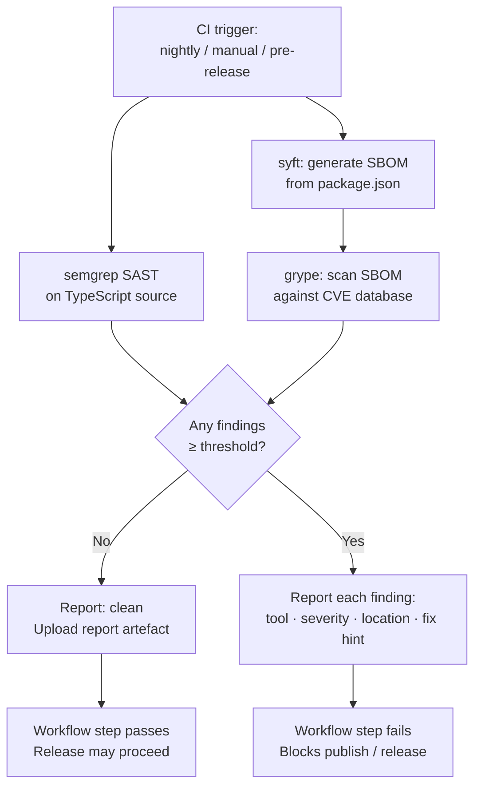

# Behaviour: Security Scanning

## Actor
CI Pipeline (GitHub Actions)

## Preconditions
- taproot source repository is checked out with dependencies installed (`npm ci`)
- semgrep, syft, and grype are available in the CI environment (installed via workflow setup steps)
- A severity threshold is configured (default: `high` — matching the existing dependency audit threshold)

## Main Flow

1. CI workflow triggers a security scan — via nightly schedule, manual trigger, or as a step in the release workflow
2. System runs semgrep with the configured SAST ruleset against taproot's TypeScript source files, reporting any code-level security findings
3. System generates a Software Bill of Materials (SBOM) from taproot's dependency manifest
4. System scans the SBOM against a known-vulnerability database, reporting any dependency with a published vulnerability
5. System compiles all findings and compares each against the configured severity threshold
6. No findings at or above the threshold are detected — system reports a clean result with a summary (tools run, rulesets used, finding count)
7. System uploads a scan report as a GitHub Actions artefact for archiving and review

## Alternate Flows

### Findings above threshold detected
- **Trigger:** One or more findings at or above the configured severity threshold are reported by semgrep or grype
- **Steps:**
  1. System outputs each finding with: tool name, severity level, affected file or package, and available remediation guidance
  2. Workflow step fails and blocks downstream steps (publish, release)
  3. Maintainer reviews findings, applies remediations, and re-triggers the scan

### Nightly scheduled run
- **Trigger:** GitHub Actions nightly schedule
- **Steps:**
  1. Workflow runs the full scan sequence (steps 2–7 of main flow)
  2. On clean result: workflow succeeds silently; report is archived as a CI artefact
  3. On findings: workflow fails; GitHub's default workflow-failure notification (GitHub web/email notification, subject to the maintainer's GitHub notification settings) is triggered

### Pre-release gate
- **Trigger:** Release workflow reaches the security scan step (during `cut-release`) — security-scanning runs as a called reusable workflow invoked by the release workflow, so its result is directly visible as a job in the release run
- **Steps:**
  1. Release workflow runs the full scan sequence before the publish step
  2. On clean result: release workflow proceeds to publish
  3. On findings: release workflow is blocked — publish does not run; maintainer must remediate and re-trigger

### Vulnerability database unavailable
- **Trigger:** grype cannot reach or update the vulnerability database during a scan
- **Steps:**
  1. System warns: "vulnerability database could not be updated — scanning with cached data"
  2. If a cached database exists: scan proceeds with the cached version; result is marked "database may be stale"
  3. If no cache exists: scan fails with "no vulnerability database available — cannot run dependency scan"

## Postconditions
- A scan report is archived as a GitHub Actions artefact
- The scan result (clean or findings) is visible as a workflow step outcome
- For pre-release runs: a clean result is a precondition for the publish step to proceed

## Error Conditions
- **Scan tool not found** — if semgrep, syft, or grype is not available in the CI environment, the workflow step fails immediately with a message naming the missing tool
- **SBOM generation fails** — if syft cannot read the dependency manifest, the workflow step fails: "Failed to generate SBOM — check that `node_modules` is present and `package.json` is valid"
- **Semgrep ruleset unavailable** — if the configured ruleset cannot be fetched (network error, invalid ruleset name), the workflow step fails; results are not marked clean
- **Vulnerability database unavailable, no cache** — if grype cannot reach the vulnerability database and no local cache exists, the workflow step fails: "no vulnerability database available — cannot run dependency scan" (see Alternate Flow: Vulnerability database unavailable)
- **Severity threshold misconfigured** — if the configured threshold value is not a recognised severity level, the workflow step fails immediately: "unrecognised severity threshold '\<value\>' — expected one of: critical, high, medium, low"

## Flow

## Related
- `./ci-pipeline/usecase.md` — the nightly security scan runs as a separate workflow from the push-triggered CI pipeline; both must pass before a release is cut
- `./cut-release/usecase.md` — the pre-release security scan gate is a step in the release procedure; `cut-release` must not proceed to publish if this scan fails

## Acceptance Criteria

**AC-3: Nightly CI scan runs on schedule**
- Given the nightly workflow is configured in GitHub Actions
- When the scheduled trigger fires
- Then the full scan sequence (semgrep + syft/grype) runs and the workflow succeeds or fails based on findings

**AC-4: Pre-release gate blocks publish when scan finds violations**
- Given the release workflow reaches the security scan step
- When one or more findings at or above the threshold are reported
- Then the release workflow exits without running the publish step

**AC-5: Pre-release gate passes and release proceeds when scan is clean**
- Given the release workflow reaches the security scan step
- When no findings at or above the threshold are reported
- Then the release workflow proceeds to the publish step

**AC-6: Manual trigger runs the full scan and reports results**
- Given the security scan workflow exists in GitHub Actions
- When the maintainer triggers it manually via the GitHub Actions UI
- Then the full scan sequence runs and results are visible in the workflow summary

**AC-7: Scan report is written as a CI artefact**
- Given a CI scan run (nightly, manual, or pre-release) completes (clean or with findings)
- When the workflow step finishes
- Then a scan report file is uploaded as a GitHub Actions artefact and retained for review

## Implementations <!-- taproot-managed -->
- [GitHub Actions Workflow](./github-workflow/impl.md)

## Status
- **State:** implemented
- **Created:** 2026-03-30
- **Last reviewed:** 2026-03-30

## Notes
- **Severity threshold default:** `high` — matching the existing `npm audit --audit-level=high` gate in `ci-pipeline`. Configurable via workflow input or environment variable.
- **semgrep ruleset:** default to `p/typescript` + `p/owasp-top-ten` unless a project-specific `.semgrep.yaml` is present. Rulesets should be pinned to avoid unexpected scan failures on rule updates.
- **grype vs npm audit:** grype scans the full SBOM against multiple CVE databases (NVD, GitHub Advisory, OSV); `npm audit` covers only the npm advisory database. Both are retained — grype supplements, not replaces, the existing npm audit in `ci-pipeline`.
- **Local scanning deferred** — CI-only reduces tool installation complexity; the manual trigger on GitHub covers the pre-release use case without requiring local tool setup.
- **PR scanning deferred** — nightly + pre-release provides the coverage needed for v1.
- **AC-1 and AC-2 reserved** — these IDs covered local scan functionality, deferred when local scanning was dropped. AC-3 is the first active criterion.
- **SBOM format:** syft default (Syft JSON) — sufficient for grype input. If downstream tooling requires SPDX or CycloneDX, the syft invocation should add `-o spdx-json` or `-o cyclonedx-json`.
- **Artefact retention:** GitHub Actions default (90 days) is sufficient for v1 audit purposes; no extended retention required.
