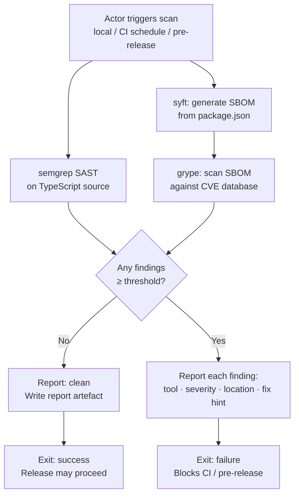

# Behaviour: Security Scanning

## Actor
- **Maintainer / Agent** — initiates a local scan before cutting a release
- **CI Pipeline (GitHub Actions)** — runs scans on a nightly schedule and as a pre-release gate

## Preconditions
- taproot source repository is checked out with dependencies installed (`npm ci`)
- semgrep is available in the environment (installed globally or via CI setup step)
- syft and grype are available in the environment
- A severity threshold is configured (default: `high` — matching the existing dependency audit threshold)

## Main Flow

1. Actor triggers a security scan — either by running the local scan command or via an automated CI workflow trigger
2. System runs semgrep with the configured SAST ruleset against taproot's TypeScript source files, reporting any code-level security findings
3. System generates a Software Bill of Materials (SBOM) from taproot's dependency manifest
4. System scans the SBOM against a known-vulnerability database, reporting any dependency with a published vulnerability
5. System compiles all findings and compares each against the configured severity threshold
6. No findings at or above the threshold are detected — system reports a clean result with a summary (tools run, rulesets used, finding count)
7. System writes a scan report to a designated output path for archiving or local review

## Alternate Flows

### Findings above threshold detected
- **Trigger:** One or more findings at or above the configured severity threshold are reported by semgrep or grype
- **Steps:**
  1. System outputs each finding with: tool name, severity level, affected file or package, and available remediation guidance
  2. System exits with a failure status
  3. For CI runs: the workflow step fails and blocks downstream steps (publish, release)
  4. Maintainer reviews findings, applies remediations, and re-runs the scan

### Nightly scheduled CI run
- **Trigger:** GitHub Actions nightly schedule
- **Steps:**
  1. CI workflow runs the full scan sequence (steps 2–7 of main flow)
  2. On clean result: workflow succeeds silently; report is archived as a CI artefact
  3. On findings: workflow fails and notifies the maintainer

### Pre-release gate
- **Trigger:** Release workflow reaches the security scan step (during `cut-release`)
- **Steps:**
  1. Release workflow runs the full scan sequence before the publish step
  2. On clean result: release workflow proceeds to publish
  3. On findings: release workflow is blocked — publish does not run; maintainer must remediate and restart the release

### Vulnerability database unavailable
- **Trigger:** grype cannot reach or update the vulnerability database during a scan
- **Steps:**
  1. System warns: "vulnerability database could not be updated — scanning with cached data"
  2. If a cached database exists: scan proceeds with the cached version; result is marked "database may be stale"
  3. If no cache exists: scan fails with "no vulnerability database available — cannot run dependency scan"

## Postconditions
- A scan report exists at the designated output path
- The scan result (clean or findings) is visible to the actor
- For CI runs: the result is recorded as a workflow step outcome and the report is archived as a CI artefact
- For pre-release runs: a clean result is a precondition for the publish step to proceed

## Error Conditions
- **Scan tool not found** — if semgrep, syft, or grype is not installed, the scan exits immediately: "Security scan tool `<name>` not found — install it before running the scan. See docs/security.md."
- **SBOM generation fails** — if syft cannot read the dependency manifest, the scan exits: "Failed to generate SBOM — check that `node_modules` is present and `package.json` is valid."
- **Semgrep ruleset unavailable** — if the configured ruleset cannot be fetched (network error, invalid ruleset name), semgrep exits with a clear error; the scan reports the failure and does not mark results as clean

## Flow

## Related
- `./ci-pipeline/usecase.md` — the nightly security scan runs as a separate workflow from the push-triggered CI pipeline; both must pass before a release is cut
- `./cut-release/usecase.md` — the pre-release security scan gate is a step in the release procedure; `cut-release` must not proceed to publish if this scan fails

## Acceptance Criteria

**AC-1: Local scan runs and reports clean when no findings**
- Given semgrep, syft, and grype are installed locally and taproot has no findings above the configured threshold
- When the maintainer runs the local scan command
- Then the scan exits with success and outputs a summary: tools run, rulesets used, finding count (0)

**AC-2: Local scan blocks when findings above threshold are detected**
- Given at least one code-level or dependency finding at or above the configured severity threshold exists
- When the local scan command runs
- Then the scan exits with failure and outputs each finding with tool name, severity, affected file or package, and remediation guidance

**AC-3: Nightly CI scan runs on schedule**
- Given the nightly workflow is configured in GitHub Actions
- When the scheduled trigger fires
- Then the full scan sequence (semgrep + syft/grype) runs and the workflow succeeds or fails based on findings

**AC-4: Pre-release gate blocks publish when scan finds violations**
- Given the release workflow reaches the security scan step
- When one or more findings at or above the threshold are reported
- Then the release workflow exits without running the publish step

**AC-5: Pre-release gate passes and release proceeds when scan is clean**
- Given the release workflow reaches the security scan step
- When no findings at or above the threshold are reported
- Then the release workflow proceeds to the publish step

**AC-6: Scan tool not found produces actionable error**
- Given semgrep, syft, or grype is not installed in the environment
- When the scan command runs
- Then it exits immediately with a message naming the missing tool and directing the user to installation instructions

**AC-7: Scan report is written as a CI artefact**
- Given a CI scan run (nightly or pre-release) completes (clean or with findings)
- When the workflow step finishes
- Then a scan report file is uploaded as a GitHub Actions artefact and retained for review

**NFR-1: Local scan completes in acceptable time for pre-release use**
- Given taproot's current codebase size (~50 TypeScript source files, ~50 direct dependencies)
- When the full local scan runs (semgrep + syft + grype)
- Then it completes within 5 minutes on a standard developer machine with a warm dependency cache

## Status
- **State:** specified
- **Created:** 2026-03-30
- **Last reviewed:** 2026-03-30

## Notes
- **Severity threshold default:** `high` — matching the existing `npm audit --audit-level=high` gate in `ci-pipeline`. The threshold should be configurable (e.g. via an environment variable or script argument) so it can be tightened to `critical` for faster iteration or relaxed temporarily for research.
- **semgrep ruleset:** default to `p/typescript` + `p/owasp-top-ten` unless a project-specific `.semgrep.yaml` is present. Rulesets should be pinned to avoid unexpected scan failures on rule updates.
- **grype vs npm audit:** grype scans the full SBOM (all transitive dependencies) against multiple CVE databases (NVD, GitHub Advisory, OSV); `npm audit` covers only the npm advisory database. Both are retained — grype supplements, not replaces, the existing npm audit in `ci-pipeline`.
- **PR scanning deferred** — scanning on every PR would add latency to the review cycle. Nightly + pre-release provides the coverage needed for v1.
