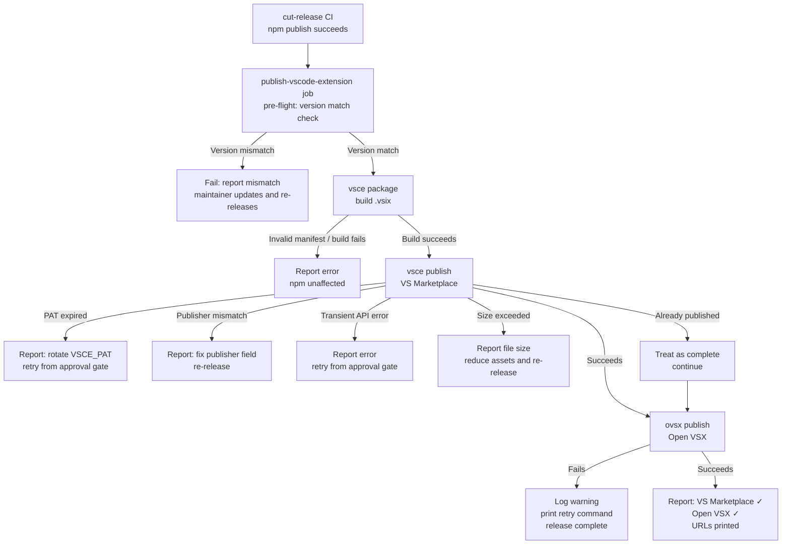

# Behaviour: Publish VS Code Extension

## Actor
Maintainer — the VS Code extension publish step runs automatically in CI as part of the `cut-release` flow, after npm publish succeeds

## Preconditions
- A VS Code Marketplace publisher account exists (one-time setup — see Alternate Flow below)
- An Open VSX publisher account exists (one-time setup)
- `VSCE_PAT` (VS Code Marketplace Personal Access Token with `Marketplace: Manage` scope) is stored as a GitHub Actions secret in the `release` environment
- `OVSX_PAT` (Open VSX token) is stored as a GitHub Actions secret in the `release` environment
- Extension source exists in `vscode-extension/` with a valid `package.json` manifest (name, publisher, version, keywords, icon, categories)
- `vscode-extension/package.json` version matches the taproot package version being released
- The `cut-release` CI workflow has been extended with a `publish-vscode-extension` job that runs after the `publish-npm` job succeeds, and a pre-flight check that verifies `vscode-extension/package.json` version matches the release version
- `vscode-extension/package.json` contains a resolved `publisher` value (not a placeholder), `displayName`, `description`, `categories`, keywords including "taproot" / "AI" / "requirements" / "BDD" / "spec" / "traceability", `icon`, a command contribution `taproot.init` with title "Taproot: Initialize project", and a walkthrough definition
- Publisher name in `vscode-extension/package.json` matches the registered VS Code Marketplace publisher account

## Main Flow

1. The `cut-release` CI `publish-vscode-extension` job starts — triggered automatically after the `publish-npm` job succeeds
2. CI builds the `.vsix` package: `cd vscode-extension && npx @vscode/vsce package`
3. CI publishes to VS Code Marketplace: `npx @vscode/vsce publish --pat $VSCE_PAT`
4. CI publishes to Open VSX: `npx ovsx publish <file>.vsix --pat $OVSX_PAT`
5. CI reports: extension version, VS Marketplace URL, Open VSX URL

## Alternate Flows

### Publisher accounts not yet created (first-time setup)
- **Trigger:** No VS Code Marketplace publisher account exists when the extension is first being set up
- **Steps:**
  1. Maintainer creates a Microsoft Azure DevOps account and a VS Code Marketplace publisher at `marketplace.visualstudio.com/manage`
  2. Maintainer generates a PAT scoped to `Marketplace: Manage`
  3. Maintainer stores the PAT as `VSCE_PAT` in the GitHub `release` environment
  4. Maintainer creates an Open VSX account at `open-vsx.org` and generates a token
  5. Maintainer stores the Open VSX token as `OVSX_PAT` in the GitHub `release` environment
  6. Maintainer runs the initial publish manually: `npx @vscode/vsce publish` and `npx ovsx publish` from the `vscode-extension/` directory
  7. Subsequent releases use the automated CI flow

### Open VSX publish fails
- **Trigger:** `ovsx publish` exits with an error (auth, network, or API issue) after VS Marketplace publish has succeeded
- **Steps:**
  1. CI logs the Open VSX error but does not fail the workflow
  2. CI reports: "VS Marketplace ✓ — Open VSX failed: `<error>`. Retry manually: `npx ovsx publish <file>.vsix --pat $OVSX_PAT`"
  3. Release is considered complete — VS Marketplace is the primary channel

### Extension version mismatch
- **Trigger:** `vscode-extension/package.json` version does not match the taproot package version at release time
- **Steps:**
  1. The `publish-vscode-extension` pre-flight step (added to `cut-release` CI as part of implementing this behaviour) detects the mismatch before `vsce package` runs
  2. CI job fails: "vscode-extension/package.json version (`X.Y.Z`) does not match release version (`A.B.C`). Update `vscode-extension/package.json` before releasing."
  3. Maintainer updates the extension version, pushes, and re-triggers the release

### Already-published version
- **Trigger:** `vsce publish` detects the version was already published (from a prior partial release attempt)
- **Steps:**
  1. CI detects the duplicate and treats it as a completed step
  2. CI continues to the Open VSX publish step without error

## Postconditions
- The extension is listed on VS Code Marketplace at `marketplace.visualstudio.com/items?itemName=imix-ai.taproot` with the correct version
- The extension is listed on Open VSX at `open-vsx.org/extension/<publisher>/taproot` (unless Open VSX publish failed)
- The extension manifest contains keywords: taproot, AI, requirements, BDD, spec, traceability — making it discoverable via VS Code Extensions panel search
- The built `.vsix` manifest declares a walkthrough and a "Taproot: Initialize project" command (verified at build time — runtime behaviour depends on extension source; see Notes)

## Error Conditions
- **`vsce publish` fails — expired PAT:** CI reports "VSCE_PAT is invalid or expired. Rotate the token in the GitHub `release` environment and re-run the workflow from the approval gate."
- **`vsce publish` fails — publisher name mismatch:** publisher field in `vscode-extension/package.json` does not match the registered Marketplace publisher; CI reports the mismatch and fails the step; maintainer corrects the publisher field and re-releases
- **`vsce publish` fails — transient API error:** VS Marketplace API returns 5xx; CI reports the error and fails the step; maintainer retries the workflow from the approval gate
- **`.vsix` exceeds Marketplace size limit (50 MB):** `vsce publish` fails with a size error; CI reports the file size; maintainer reduces bundled assets and re-releases
- **`vsce package` fails — invalid manifest:** CI reports the manifest validation error and exits; maintainer fixes `vscode-extension/package.json` and re-releases
- **Extension build fails:** `vsce package` exits non-zero; CI aborts the VS Code publish step and reports the build error; npm publish is unaffected (it already succeeded)

## Flow

## Related
- `../cut-release/usecase.md` — this behaviour adds a `publish-vscode-extension` CI job and a pre-flight version-match check to `cut-release`; implementing this behaviour requires updating `cut-release`
- `../../project-presentation/welcoming-readme/usecase.md` — README content feeds the Marketplace listing description; the two must stay consistent

## Acceptance Criteria

**AC-1: Extension published to both registries on release**
- Given the release CI has completed npm publish and both `VSCE_PAT` and `OVSX_PAT` are valid
- When the VS Code publish step runs
- Then the extension is listed on VS Code Marketplace and Open VSX with the version matching the released npm package

**AC-2: Open VSX failure does not block the release**
- Given `ovsx publish` exits with an error after VS Marketplace publish succeeded
- When the CI step processes the error
- Then the workflow continues, reports the Open VSX error with a manual retry command, and marks the release complete

**AC-3: Version mismatch detected in pre-flight**
- Given `vscode-extension/package.json` contains a version different from the taproot release version
- When the `publish-vscode-extension` pre-flight step runs
- Then the CI job fails with a message naming both versions before `vsce package` runs

**AC-4: Expired PAT produces a documented recovery path**
- Given `VSCE_PAT` is invalid or expired at publish time
- When `vsce publish` fails with an auth error
- Then CI reports the cause and prints instructions to rotate the token and retry from the approval gate

**AC-5: Already-published version treated as complete**
- Given the extension version was already published in a prior partial attempt
- When `vsce publish` detects the duplicate
- Then CI treats it as a completed step and continues to Open VSX publish

**AC-6: Built .vsix declares the initialize command**
- Given the `.vsix` has been built from `vscode-extension/`
- When the extension manifest is inspected
- Then it contains a command contribution with id `taproot.init` and title "Taproot: Initialize project"

**AC-7: Built .vsix declares a Get Started walkthrough**
- Given the `.vsix` has been built from `vscode-extension/`
- When the extension manifest is inspected
- Then it contains at least one walkthrough definition with a step describing taproot initialization

## Implementations <!-- taproot-managed -->
- [VS Code Extension and CI Publish](./multi-surface/impl.md)

## Status
- **State:** specified
- **Created:** 2026-03-26
- **Last reviewed:** 2026-03-28

## Notes
- **Marketplace propagation delay:** VS Marketplace typically takes 5–15 minutes to propagate a newly published version. The release summary URL may return 404 immediately after publish — this is not a failure.
- **Implementation requires modifying `cut-release`:** this behaviour adds (a) a pre-flight version-match check and (b) a `publish-vscode-extension` CI job to `cut-release`. Both are in scope for implementing this behaviour. See `cut-release`'s Related section after implementation.
- **Extension runtime behaviour** (what happens after install: walkthrough UX, command terminal integration) is verified by AC-6 and AC-7 at build time via manifest inspection. End-to-end runtime testing (install in VS Code, run command) is deferred to manual smoke test.
- **Publisher name:** `imix-ai` — permanent Marketplace URL: `marketplace.visualstudio.com/items?itemName=imix-ai.taproot`.
- **Implementation phases**: two separable phases allow partial progress:
  - **Phase 1 (local — agent-completable):** icon at `vscode-extension/icon.png` (128×128, derived from `assets/logo-512.png`); `vscode-extension/package-lock.json` generated via `npm install`; release skill updated to bump both `package.json` versions; publisher placeholder resolved to `imix-ai`. These require no external accounts.
  - **Phase 2 (external — human action required):** create the `imix-ai` publisher account at `marketplace.visualstudio.com/manage`, generate `VSCE_PAT` and `OVSX_PAT`, store both as GitHub `release` environment secrets. Phase 2 must complete before the CI publish flow can run end-to-end.
- **Shared brand assets:** `assets/` at project root holds the master icon set (`logo.svg`, `logo-96.png`, `logo-192.png`, `logo-512.png`, `favicon.ico`, `apple-touch-icon.png`). The VS Code extension icon (`vscode-extension/icon.png`) is a 128×128 copy derived from `assets/logo-512.png`.
