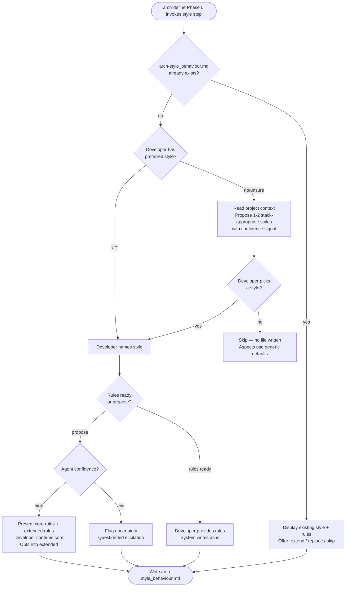

# Behaviour: Define Architectural Style Conventions

## Actor
Developer setting up architecture quality guidance for a project

## Preconditions
- The architecture module is active in the project
- Project context record exists (product type and stack are known)

## Main Flow
1. System (invoked as part of arch-define Phase 0) asks whether the project follows a preferred architectural style — such as clean architecture, hexagonal architecture, microservices, self-contained systems, or another named style.
2. Developer names the preferred style.
3. System asks how to populate the style's conventions:
   - [A] I have a ruleset — I'll provide the rules directly
   - [B] Propose canonical rules for me to review and trim
4. On [A]: Developer provides the rules; system writes them as-is.
5. On [B]: System synthesises what it knows about the named style and presents two groups inline — core rules (the rules that define the style; an agent without these would produce clearly wrong implementations) and extended rules (nuances the team may or may not adopt). Developer reviews, optionally edits individual rules, then confirms the core rules and selects from the extended rules.
6. System writes `arch-style_behaviour.md` in `taproot/global-truths/` containing the confirmed style name, core rules, any selected extended rules, and an agent checklist. The agent checklist contains a single entry: "Does this implementation follow the declared architectural style and avoid violating any of its confirmed core rules?"

## Alternate Flows

### No preferred style — stack-informed suggestion
- **Trigger:** Developer says the project has no preferred architectural style, or is unsure.
- **Steps:**
  1. System reads the project context record and derives 1–2 architectural styles that are viable and idiomatic for the declared stack, with a confidence signal for each:
     - *[High confidence]* — well-established idiom for this stack (e.g. small clearly-named packages for Go, convention-over-configuration for Rails)
     - *[Low confidence]* — stack is newer or less opinionated; agent knowledge is limited
  2. System presents the suggestions with a one-sentence rationale per style.
  3. Developer picks a suggestion, names a different style, or declines to declare a style for now.
  4. If developer declines: system notes the style step is skipped; subsequent aspects proceed with generic defaults.

### Low-confidence stack — question-led elicitation
- **Trigger:** System has low confidence in its architectural recommendations for the declared stack.
- **Steps:**
  1. System explicitly flags uncertainty: "I don't have strong knowledge of established patterns for [stack] — I'd suggest we derive your conventions through questions rather than starting from a preset."
  2. System asks targeted questions to elicit the team's structural intentions (how are cross-cutting concerns handled, where does data access live, how are entry points separated from business logic).
  3. Developer answers; system derives conventions from the answers and writes them to `arch-style_behaviour.md` as custom conventions rather than a named canonical style. The resulting file uses 'Custom' as the style name (or a developer-provided label) and formats conventions as a flat list under `## Conventions` rather than core/extended groups.

### Style already defined
- **Trigger:** `arch-style_behaviour.md` already exists in `taproot/global-truths/`.
- **Steps:**
  1. System displays the existing style name, core rules, and any extended rules.
  2. System offers: extend with additional rules, replace, or skip.
  3. Developer chooses; system proceeds accordingly.

### Developer skips style step
- **Trigger:** Developer declines to declare a style and does not want suggestions.
- **Steps:**
  1. System notes the style step is skipped.
  2. No `arch-style_behaviour.md` is written.
  3. Subsequent arch-define aspects proceed with generic defaults.

## Postconditions
- `arch-style_behaviour.md` exists in `taproot/global-truths/` with the declared style name, confirmed core rules, selected extended rules, and an agent checklist — or the step is explicitly skipped with no file written
- Subsequent arch-define aspect sub-skills read `arch-style_behaviour.md` (if present) at their scan step and use the declared style name and core rules to inform their default convention proposals — module-boundaries in particular adapts its layer questions to the declared style

## Error Conditions
- **Project context not available**: System proceeds without stack-informed suggestions; style question is asked generically without a recommendation.
- **Named style not recognised**: System flags that it has no built-in knowledge of the named style and offers question-led elicitation to derive conventions.

## Flow

## Related
- `taproot-modules/architecture/usecase.md` — parent: architecture module activation; this step runs as Phase 0 of that behaviour
- `taproot-modules/architecture/agent-skill/impl.md` — implementation of the arch-define orchestrator that invokes this step
- `taproot-modules/user-experience/usecase.md` — parallel: UX module activation follows the same Phase 0 context-establishment pattern

## Acceptance Criteria

**AC-1: Style declared — canonical rules proposed and confirmed**
- Given a project with no existing architectural style file and a developer who names a preferred style
- When developer selects "propose canonical rules"
- Then system presents core and extended rule groups inline, developer confirms core and selects from extended, and `arch-style_behaviour.md` is written

**AC-2: Style declared — developer provides own rules**
- Given a developer who names a preferred style and has a ruleset ready
- When developer selects "I'll provide the rules"
- Then system writes the developer-provided rules to `arch-style_behaviour.md` without modification

**AC-3: No preferred style — stack-informed suggestion accepted**
- Given a developer who has no preferred style and a project context with a known stack
- When system presents stack-appropriate suggestions and developer picks one
- Then system presents core and extended rule groups inline for the suggested style, developer confirms core and selects from extended, and `arch-style_behaviour.md` is written

**AC-4: No preferred style — developer declines suggestions**
- Given a developer who has no preferred style and declines all suggestions
- When developer skips the style step
- Then no `arch-style_behaviour.md` is written and subsequent aspects proceed with generic defaults

**AC-5: Low-confidence stack — question-led elicitation**
- Given a stack for which the agent has low confidence in architectural recommendations
- When system flags uncertainty and developer accepts question-led elicitation
- Then system derives conventions from questions and writes `arch-style_behaviour.md` as custom conventions (no named style)

**AC-6: Style already defined — extend offered**
- Given an existing `arch-style_behaviour.md`
- When developer invokes the style step
- Then system displays existing conventions and offers extend, replace, or skip

**AC-7: Named style not recognised**
- Given a developer who names an architectural style the agent does not recognise
- When system cannot find built-in knowledge for the named style
- Then system flags uncertainty and offers question-led elicitation

## Status
- **State:** specified
- **Created:** 2026-04-12
- **Last reviewed:** 2026-04-12
