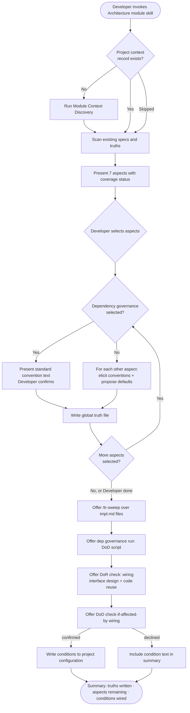

# Behaviour: Activate Architecture Module

## Actor
Developer (team lead or contributor) setting up architecture quality guidance for a project

## Preconditions
- Taproot is initialized in the project
- Developer has access to the codebase and its existing specs

## Main Flow
1. Developer invokes the architecture module skill.
2. System checks whether a project context record exists; if absent, system runs context discovery (Module Context Discovery behaviour) before proceeding.
3. System scans existing specs, code, and global truths and reports which of the 7 architecture aspects already have partial coverage.
4. System presents the 7 aspects — interface design, code reuse, dependency governance, module boundaries, error handling strategy, test structure/placement, naming conventions — marking any with existing coverage.
5. Developer selects which aspects to define in this session (all or a subset).
6. For each selected aspect (except dependency governance), system asks targeted questions, uses the established project context to propose stack-appropriate defaults, and surfaces discovered patterns from the codebase; developer reviews and confirms the elicited conventions. For dependency governance, system presents the standard convention text for developer confirmation.
7. System writes a scoped global truth file for each completed aspect (e.g., `arch-interface-design_behaviour.md`) containing conventions and an agent checklist.
8. System offers the developer the option to run `/tr-sweep` over existing impl.md files to surface implementations that may not conform to the newly written conventions; developer accepts or skips.
9. For dependency governance: system additionally offers to wire an optional `run:` DoD condition — developer provides a stack-specific manifest diff command or skips.
10. System offers to wire DoR `check:` conditions for interface design ("does the planned interface conflict with existing patterns?") and code reuse ("does an existing abstraction already cover this?") into `definitionOfReady` in project configuration — developer confirms or declines each.
11. System asks whether to wire `check-if-affected-by: taproot-modules/architecture` as a DoD condition in project configuration.
12. Developer confirms or declines.
13. System writes all confirmed conditions to project configuration and presents a summary of truths written, aspects remaining, and conditions wired.

## Alternate Flows

### Aspect already defined
- **Trigger:** A global truth file for the aspect already exists.
- **Steps:**
  1. System displays the existing conventions and checklist for the aspect.
  2. System offers: extend with new conventions, replace, or skip.
  3. Developer chooses; system proceeds accordingly.

### Partial session
- **Trigger:** Developer selects Done before all selected aspects are completed.
- **Steps:**
  1. System writes global truth files for all completed aspects.
  2. System records remaining aspects as not yet defined in the session summary output; when the module is re-invoked, the scan in main flow step 3 will surface these as uncovered aspects.
  3. System notes the module can be re-invoked to continue with uncovered aspects.

### DoD wiring declined
- **Trigger:** Developer declines the DoD wiring offer in step 11.
- **Steps:**
  1. System skips writing the DoD condition.
  2. System includes the condition text in the summary so developer can add it manually.

### Dependency governance run: script skipped
- **Trigger:** Developer skips the optional `run:` script in step 9.
- **Steps:**
  1. System writes the dependency governance truth without a wired DoD command.
  2. System notes the script can be added manually to project configuration later.

### Activated without project context
- **Trigger:** Developer skips or declines context discovery when prompted in step 2.
- **Steps:**
  1. System proceeds using generic defaults for sub-skill questions.
  2. No project context record is written.
  3. System notes that context can be established at any future session by re-invoking the skill.

## Postconditions
- A scoped global truth file exists for each completed aspect, containing conventions and a checklist for agents to apply at DoR/DoD time
- Dependency governance truth includes a `run:` DoD condition if developer provided a script
- DoR `check:` conditions for interface design and code reuse are wired in `definitionOfReady` (if developer confirmed in step 10)
- DoD condition `check-if-affected-by: taproot-modules/architecture` is wired in project configuration (if developer confirmed in step 12)
- If context discovery ran, the project context record is available for other quality modules to use in subsequent sessions

## Error Conditions
- **Taproot not initialized**: System stops with a message directing the developer to run `taproot init` before activating any module.
- **Project configuration not writable**: System presents the DoD condition text and target file path so the developer can add it manually.

## Flow

## Notes

DoR/DoD wiring per aspect — for the implementing agent:

| Aspect | DoR | DoD |
|---|---|---|
| interface design | `check:` — does the planned interface conflict with existing patterns? | ✓ conventions applied |
| Code reuse | `check:` — does an existing abstraction already cover this? | ✓ no duplication introduced |
| Dependency governance | global truth convention | optional `run:` script |
| Module boundaries | — | ✓ boundaries respected |
| Error handling strategy | — | ✓ strategy followed |
| Test structure/placement | — | ✓ tests land in correct location |
| Naming conventions | — | ✓ names follow conventions |

## Behaviours <!-- taproot-managed -->

## Related
- `taproot-modules/intent.md` — parent intent: optional module system goal and constraints
- `module-context-discovery/usecase.md` — runs as a prerequisite step; produces the project context record this behaviour consumes

## Implementations <!-- taproot-managed -->

## Acceptance Criteria

**AC-1: Full session — all aspects defined and DoD wired**
- Given a taproot-initialized project with no existing architecture truths
- When developer invokes the architecture module skill and works through all 7 aspects
- Then 7 global truth files are written and the DoD condition is added to project configuration

**AC-2: Aspect already defined — extend or skip offered**
- Given a project where an architecture truth file already exists for one or more aspects
- When developer invokes the skill and reaches an already-defined aspect
- Then system shows existing conventions and offers to extend, replace, or skip

**AC-3: Partial session — developer stops early**
- Given a session in progress with some aspects completed
- When developer selects Done before all aspects are covered
- Then truths are written for completed aspects and remaining aspects are noted in the session summary

**AC-4: Dependency governance — run: script offered and wired**
- Given a session where dependency governance is selected
- When developer provides a stack-specific manifest diff command
- Then the command is wired as a `run:` DoD condition in project configuration

**AC-5: Dependency governance — run: script skipped**
- Given a session where dependency governance is selected
- When developer skips the run: script offer
- Then the truth is written without a wired DoD command and a note is included in the summary

**AC-6: DoD wiring declined**
- Given a session where at least one aspect is defined
- When developer declines the DoD wiring offer
- Then no DoD condition is written and the condition text appears in the session summary

**AC-7: Taproot not initialized**
- Given a directory without taproot initialization
- When developer invokes the architecture module skill
- Then system stops with a message to initialize taproot first

**AC-8: Context discovery runs before aspect selection on first invocation**
- Given no project context record exists
- When developer invokes the architecture module skill
- Then system runs Module Context Discovery before presenting the 7 aspects

**AC-9: DoR check: conditions offered and wired**
- Given a session where interface design or code reuse aspects are defined
- When developer confirms the DoR wiring offer in step 10
- Then the corresponding `check:` conditions are written to `definitionOfReady` in project configuration

**AC-10: DoR check: conditions declined**
- Given a session where interface design or code reuse aspects are defined
- When developer declines the DoR wiring offer in step 10
- Then no DoR conditions are written and the condition text appears in the session summary

**AC-11: /tr-sweep offered after truth files written**
- Given at least one global truth file has been written in the session
- When the aspect loop completes or developer signals Done
- Then system offers to run `/tr-sweep` over existing impl.md files before proceeding to wiring

## Status
- **State:** specified
- **Created:** 2026-04-12
- **Last reviewed:** 2026-04-12
