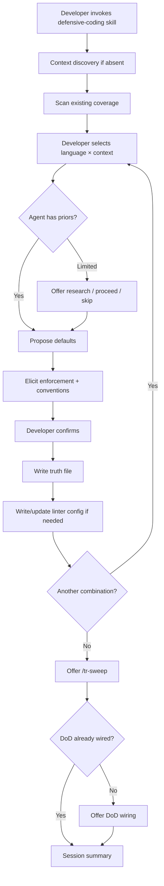

# Behaviour: Activate Defensive Coding Module

## Actor
Developer (team lead or contributor) setting up defensive coding guidance for a project

## Preconditions
- Taproot is initialized in the project
- Developer has access to the codebase and its existing configuration

## Main Flow
1. Developer invokes the defensive coding module skill.
2. System checks whether a project context record exists; if absent, system runs context discovery (Module Context Discovery behaviour) before proceeding.
3. System scans existing global truths for defensive coding truth files matching `defensive-*_behaviour.md` and reports which language × context combinations already have coverage.
4. Developer selects a language and optionally a context to configure. System asks: "Which language do you want to configure? (e.g. TypeScript, Python, Go — or describe your stack)" and offers **[H]** Get help — scan the project and propose detected stacks. If context is omitted, conventions apply to the language generally.
5. System assesses its knowledge of defensive coding conventions for the selected language. If the system has sufficient priors, it proposes opinionated defaults for the developer to review. If the system has limited knowledge of the language, it offers to research defensive patterns before elicitation.
6. System elicits or confirms two categories of convention for the selected language × context:
   a. **Enforcement** — linter rules and static analysis configuration that mechanically prevent fragile code patterns (compiler flags and build configuration are out of scope for this module)
   b. **Conventions** — patterns to follow and anti-patterns to avoid, capturing what an experienced reviewer would flag
7. System presents the proposed enforcement rules and conventions for developer review and confirmation.
8. System writes a single global truth file for the completed language × context combination (e.g. `defensive-typescript-frontend_behaviour.md`) containing both enforcement rules and conventions with an agent checklist.
9. System detects existing linter or static analysis configuration in the project. If enforcement rules were confirmed and tooling configuration is absent or incomplete, system writes or updates the linter configuration file to apply the confirmed rules. Developer confirms before any config file is written.
10. System asks whether to configure another language × context combination. If yes, return to step 4. If no, proceed.
11. System offers the developer the option to run `/tr-sweep` over existing implementations to surface code that may not conform to the newly written conventions.
12. If `check-if-affected-by: taproot-modules/defensive-coding` is not already present in the project's `definitionOfDone`, system asks whether to wire it as a DoD condition in project configuration. If already wired, skip this step.
13. Developer confirms or declines.
14. System writes the condition to project configuration (if confirmed) and presents a summary: truth files written, combinations configured, and conditions wired.

## Alternate Flows

### Agent has limited knowledge of language
- **Trigger:** At step 5, system determines it has limited knowledge of defensive coding conventions for the selected language.
- **Steps:**
  1. System states: "I have limited knowledge of [language] defensive patterns. I can propose what I know, or research conventions first."
  2. Options: **[A]** Research first — system runs a research pass and proposes findings for developer confirmation before elicitation; **[B]** Proceed with what I know — system proposes what it has with lower confidence noted; **[C]** Skip this language.
  3. On **[A]**: system researches conventions and surfaces findings; developer confirms accuracy before proceeding to step 6.
  4. On **[B]**: system proceeds with noted uncertainty; developer reviews and adjusts each proposed default.
  5. On **[C]**: system skips to step 10.

### Truth file already exists for combination
- **Trigger:** At step 4, the selected language × context combination already has a truth file.
- **Steps:**
  1. System displays the existing conventions and checklist.
  2. Options: **[A]** Extend — add to existing conventions; **[B]** Replace — discard and re-elicit; **[C]** Skip.
  3. Developer chooses; system proceeds accordingly.

### Linter config already present
- **Trigger:** At step 9, existing linter configuration already covers some or all of the confirmed enforcement rules.
- **Steps:**
  1. System reports which rules are already configured and which are missing.
  2. System offers to add only the missing rules to the existing configuration.
  3. Developer confirms before any file is written.

### Partial session
- **Trigger:** Developer selects Done before all desired combinations are completed.
- **Steps:**
  1. System writes truth files for all completed combinations.
  2. System presents a session summary of completed combinations. When the module is re-invoked, the scan in step 3 will surface any language × context combinations that still lack truth files.

### DoD condition already wired
- **Trigger:** At step 12, `check-if-affected-by: taproot-modules/defensive-coding` is already present in the project's `definitionOfDone`.
- **Steps:**
  1. System skips the DoD wiring offer and notes "Defensive coding DoD condition already wired." in the session summary.

### DoD wiring declined
- **Trigger:** Developer declines the DoD wiring offer in step 12.
- **Steps:**
  1. System skips writing the DoD condition to project configuration.
  2. System displays the line to add manually and presents the session summary.

## Postconditions
- One or more truth files exist in `taproot/global-truths/` for configured language × context combinations
- Linter configuration updated for confirmed enforcement rules (if applicable and confirmed)
- Project configuration optionally updated with `check-if-affected-by: taproot-modules/defensive-coding` in `definitionOfDone`

## Error Conditions
- **No language selected and no existing combinations found**: system reports "No defensive coding conventions configured yet. Start by selecting a language." and offers to begin.
- **Linter config write fails**: system reports the failure, presents the rules as a copyable block for manual application, and continues.
- **Linter configuration format not recognized or is dynamic**: system reports "Found a linter configuration at [path] but cannot safely modify it — the format is dynamic or unrecognized. Here are the rules to add manually: [block]." Session continues without writing the config file.
- **Research step produces no useful findings**: system reports "I was unable to find established defensive coding conventions for [language]. Proceeding with first principles." and continues to step 6 with generic prompts.

## Flow

## Related
- `taproot-modules/module-context-discovery/usecase.md` — provides project context used to propose stack-appropriate defaults
- `taproot-modules/architecture/usecase.md` — peer module; architecture owns error propagation strategy; defensive-coding owns expression-level robustness rules; cross-reference each from the other's truth files
- `taproot-modules/security/usecase.md` — peer module; security local-tooling sub-skill establishes the linter-config-write pattern this module follows

## Acceptance Criteria

**AC-1: Happy path — new language configured end to end**
- Given no defensive coding truth files exist and the developer selects TypeScript
- When the developer invokes the defensive coding module, confirms conventions, and accepts DoD wiring
- Then a `defensive-typescript_behaviour.md` truth file is written, linter config is updated, and `check-if-affected-by: taproot-modules/defensive-coding` appears in project configuration

**AC-2: Known language — opinionated defaults proposed**
- Given the developer selects a language the system has established knowledge of
- When elicitation begins
- Then system proposes specific default conventions for the developer to review rather than asking open-ended questions

**AC-3: Unknown language — research offered**
- Given the developer selects a language with limited agent priors (e.g. Lua)
- When elicitation begins
- Then system states its limited knowledge and offers [A] Research first / [B] Proceed with what I know / [C] Skip — without proposing defaults it cannot substantiate with established conventions for that language

**AC-4: Context qualifier produces separate truth file**
- Given the developer selects "TypeScript — frontend" and "TypeScript — backend" in separate runs
- When each run completes
- Then `defensive-typescript-frontend_behaviour.md` and `defensive-typescript-backend_behaviour.md` are written as separate files

**AC-5: Existing truth file — extend or replace offered**
- Given `defensive-python_behaviour.md` already exists
- When the developer selects Python
- Then system displays the existing conventions and offers [A] Extend / [B] Replace / [C] Skip before eliciting new conventions

**AC-6: Linter config written only after developer confirmation**
- Given the developer confirms enforcement rules and no linter config exists
- When system reaches the linter config step
- Then system presents the proposed config changes and requires explicit confirmation before writing any file

**AC-7: Partial linter config — only missing rules added**
- Given a linter config already exists with some confirmed rules present
- When system writes enforcement configuration
- Then only the missing rules are added; existing rules are not modified

**AC-8: DoD condition not offered when already wired**
- Given `check-if-affected-by: taproot-modules/defensive-coding` is already in project configuration
- When the session reaches the DoD wiring step
- Then system skips the offer and notes "Defensive coding DoD condition already wired." in the session summary

**AC-9: Multi-combination session**
- Given the developer configures TypeScript in the first pass
- When asked "configure another combination?" and selects yes
- Then system returns to language selection and allows a second combination to be configured in the same session

**AC-10: /tr-sweep offered once after all combinations complete**
- Given the developer has completed all desired language × context combinations
- When the developer declines to configure another combination
- Then system offers /tr-sweep once before proceeding to DoD wiring — not after each individual combination

**AC-11: DoD wiring declined — manual instruction shown**
- Given the developer declines the DoD wiring offer
- When the session concludes
- Then system displays the line to add manually to project configuration and presents the session summary without writing to project configuration

**AC-12: Unrecognized linter config format — rules presented as copyable block**
- Given the project has a dynamic or unrecognized linter configuration format
- When system reaches the linter config write step
- Then system reports it cannot safely modify the file and presents the confirmed rules as a copyable block for manual application

## Status
- **State:** specified
- **Created:** 2026-04-16
- **Last reviewed:** 2026-04-16
