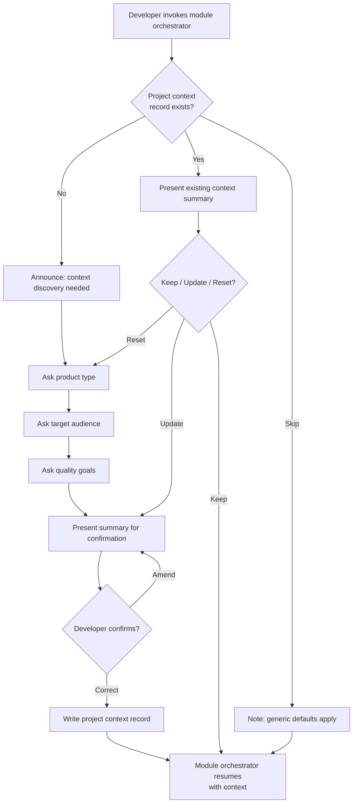

# Behaviour: Module Context Discovery

## Actor
Developer activating a quality module on a project for the first time

## Preconditions
- Taproot is initialised in the project
- At least one quality module is declared in project settings and its skills are installed
- Developer is about to invoke a module orchestrator skill (e.g. `/tr-ux-define`)

## Main Flow
1. Developer invokes a module orchestrator skill.
2. System checks whether a project context record exists in the project's global truths.
3. System finds no project context record and announces it needs to establish one before proceeding.
4. System asks the developer to describe the product type — offering archetypes as orientation (marketing website, productivity app, developer tool, design showcase, e-commerce store, consumer mobile app, etc.) and accepting freeform descriptions.
5. Developer describes the product type and any defining characteristics.
6. System asks who the primary users are and what they come to accomplish.
7. Developer describes the target audience and their goals.
8. System asks which 2–3 quality goals matter most for this product — offering examples (visual polish, performance, simplicity, trust and credibility, accessibility, discoverability).
9. Developer names the quality goals.
10. System presents a summary of the gathered context and asks the developer to confirm or correct it.
11. Developer confirms the summary.
12. System writes the project context record to the project's global truths.
13. Module orchestrator resumes, using the established context to propose informed defaults throughout its sub-skill questions.

## Alternate Flows

### Context already exists
- **Trigger:** A project context record is found in global truths when a module orchestrator starts.
- **Steps:**
  1. System presents a one-paragraph summary of the existing context.
  2. System offers: **[K] Keep and continue** — use as-is, **[U] Update** — revise before continuing, **[R] Reset** — discard and re-run discovery.
  3. If **[K]**: skip to step 13 of the main flow.
  4. If **[U]**: present each field for review; developer amends any or all; system re-summarises and confirms, then writes the updated record and resumes.
  5. If **[R]**: discard the existing record and run the full main flow from step 4.

### Developer skips context
- **Trigger:** Developer says "skip", "later", or declines to describe the project.
- **Steps:**
  1. System notes that project context is undefined and module conventions will be applied using generic defaults.
  2. Module orchestrator proceeds without a project context record.
  3. System offers to run context discovery at any future point before continuing a module session.

### Partial context provided
- **Trigger:** Developer answers some questions but not others (e.g. describes product type but cannot name quality goals).
- **Steps:**
  1. System uses answered fields and marks unanswered fields as undefined.
  2. System writes the partial record and notes which fields are undefined.
  3. Module orchestrator uses available context and falls back to generic defaults for undefined fields.

## Postconditions
- A project context record exists in the project's global truths containing product type, target audience, and quality goals
- The active module orchestrator uses the context to propose archetype-appropriate defaults rather than asking open-ended questions

## Error Conditions
- **Developer cannot describe the product**: System acknowledges the ambiguity, proceeds with generic defaults, and notes the context record was not written — the developer can establish it at any time before the next module session.

## Flow

## Related
- `user-experience/usecase.md` — first consumer; `/tr-ux-define` runs context discovery before the 9-aspect scan
- `module-install-opt-in/usecase.md` — prerequisite: module must be installed before its orchestrator can invoke context discovery

## Acceptance Criteria

**AC-1: Context written on first module activation**
- Given no project context record exists
- When Developer invokes a module orchestrator skill
- Then system runs context discovery, captures product type, audience, and quality goals, and writes the project context record before the module session begins

**AC-2: Existing context reused without re-asking**
- Given a project context record exists
- When Developer invokes any module orchestrator skill
- Then system presents the existing context summary and offers Keep / Update / Reset — it does not re-ask all questions

**AC-3: Module uses context to propose defaults**
- Given a project context record names the product archetype
- When a module sub-skill asks a convention question
- Then the sub-skill proposes an archetype-appropriate default rather than an open-ended question

**AC-4: Developer can skip context discovery**
- Given no project context record exists
- When Developer declines to describe the project
- Then module orchestrator proceeds with generic defaults and no context record is written

**AC-5: Partial context accepted**
- Given Developer answers some but not all context questions
- When Developer stops answering and the module continues
- Then system writes the partial record and module uses available fields with generic defaults for undefined ones

**AC-6: Context record shared across modules**
- Given a project context record was written during a UX module session
- When Developer later activates a different module
- Then the second module reads the same record — context discovery is not repeated

## Status
- **State:** specified
- **Created:** 2026-04-11
- **Last reviewed:** 2026-04-11
