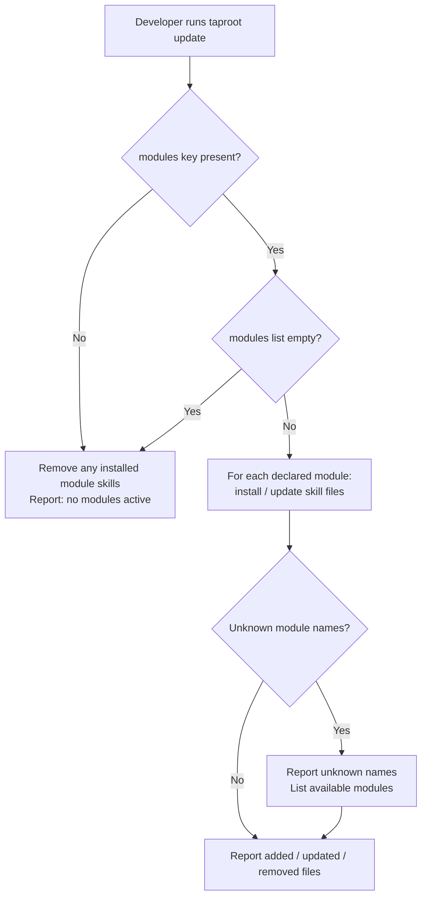

# Behaviour: Module Installation Opt-In

## Actor
Developer configuring which quality modules are active in a project

## Preconditions
- `taproot init` has been run; project settings exist
- `taproot update` is available

## Main Flow
1. Developer adds a `modules:` list to the project settings naming the modules they want (e.g. `modules: [user-experience]`).
2. Developer runs `taproot update`.
3. System reads the declared modules from the project settings.
4. System installs skill files for each declared module and skips skill files for all undeclared modules.
5. System reports which module skill files were added, updated, or removed.

## Alternate Flows

### No modules declared
- **Trigger:** Project settings have no `modules:` key, or the list is empty.
- **Steps:**
  1. System installs no module skill files.
  2. Any module skill files previously installed are removed from the project.
  3. System reports that no modules are active.

### Module removed from declaration
- **Trigger:** A module was previously declared and its skill files are installed; developer removes it from the modules list.
- **Steps:**
  1. System detects that installed module skill files are no longer declared.
  2. System removes those skill files from the project.
  3. System reports the removed files.

### taproot init with modules declared
- **Trigger:** Developer runs `taproot init` on a project where modules are already declared in project settings.
- **Steps:**
  1. System reads the modules list and installs only declared module skill files.
  2. Non-module skills are installed as normal.

## Postconditions
- Only skill files for declared modules are present in the project
- Skill files for undeclared modules are absent
- Non-module skill files are unaffected by the modules setting

## Error Conditions
- **Unknown module name in modules list**: system reports the unknown name and lists available modules; installation continues for valid entries.
- **Declared module exists but has no skill files yet**: system reports the gap and continues.

## Flow

## Related
- `taproot-modules/user-experience/usecase.md` — declares UX conventions after module skills are installed; depends on skill files being present

## Acceptance Criteria

**AC-1: Declared module skills installed**
- Given the project declares `modules: [user-experience]` in settings
- When Developer runs `taproot update`
- Then `ux-define.md` and the 9 UX sub-skill files are installed; no other module skill files are present

**AC-2: No modules declared — no module skills present**
- Given the project settings have no `modules:` key
- When Developer runs `taproot update`
- Then no module skill files are installed and none are added to the project

**AC-3: Module removed from declaration — skills removed**
- Given UX skill files are present in the project and the modules list no longer includes `user-experience`
- When Developer runs `taproot update`
- Then the UX skill files are removed from the project

**AC-4: Unknown module name reported**
- Given the project declares an unrecognised module name in the modules list
- When Developer runs `taproot update`
- Then the system reports the unknown name and lists available modules; update completes for other valid entries

**AC-5: taproot init respects modules setting**
- Given the project settings declare `modules: [user-experience]`
- When Developer runs `taproot init`
- Then only `user-experience` module skill files are installed alongside standard skills

**AC-6: Non-module skills unaffected**
- Given the project settings have no `modules:` key
- When Developer runs `taproot update`
- Then all non-module skill files are installed as normal

## Implementations <!-- taproot-managed -->
- [Settings Opt-In](./settings-opt-in/impl.md)

## Status
- **State:** implemented
- **Created:** 2026-04-11
- **Last reviewed:** 2026-04-11
