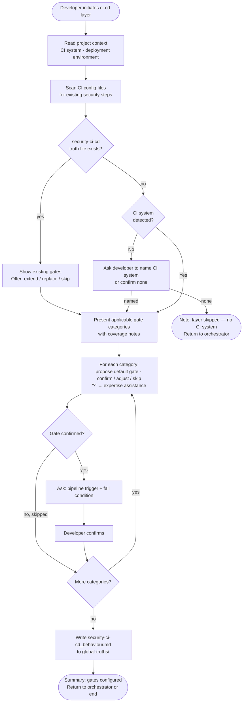

# Behaviour: Configure CI/CD Security Gates

## Actor
Developer configuring which security gates run in the CI/CD pipeline, invoked by the security module orchestrator or directly

## Preconditions
- Taproot is initialized in the project
- Security module skill is installed
- Project context record is available (CI system, deployment environment) — or developer has accepted generic defaults

## Main Flow
1. Developer initiates the ci-cd layer configuration.
2. System reads the project context record to determine CI system and deployment environment.
3. System scans existing CI configuration files for any security steps already in place and notes detected gates.
4. System presents the gate categories — SAST, secrets scanning, dependency vulnerability checks, container/image scanning, DAST — filtering out categories not applicable to the deployment environment, and marking any with detected configuration.
5. For each applicable category, system proposes a default gate configuration drawn from project context and asks the developer to confirm, adjust, or skip. Developer may select **[?] Get help** to request agent assistance before answering.
6. For each confirmed gate, system asks: which pipeline trigger (on PR, on merge to main, on schedule) and whether a finding blocks the pipeline or warns only.
7. Developer confirms the trigger and fail condition for each gate.
8. System writes `security-ci-cd_behaviour.md` to `taproot/global-truths/` containing the confirmed gates, triggers, and fail conditions.
9. System presents a summary of gates configured and returns control to the security module orchestrator (or ends the session if invoked directly).

## Alternate Flows

### Gate configuration file already exists
- **Trigger:** `security-ci-cd_behaviour.md` already exists in `taproot/global-truths/`.
- **Steps:**
  1. System displays the existing gates, triggers, and fail conditions.
  2. System offers: extend with additional gates, replace, or skip.
  3. Developer chooses; system proceeds accordingly.

### Developer skips a gate category
- **Trigger:** Developer selects skip for a gate category.
- **Steps:**
  1. System omits the category from the truth file.
  2. System notes the skipped category in the session summary.
  3. Session continues with the next category.

### No CI system detected
- **Trigger:** No CI configuration files are found in the project and project context does not name a CI system.
- **Steps:**
  1. System notes no CI system was detected and asks the developer to name their CI system or confirm there is none.
  2. If developer names a CI system: system proceeds using generic defaults for that system.
  3. If developer confirms no CI: system notes the layer cannot be configured and suggests revisiting when CI is introduced.

### No project context available
- **Trigger:** No project context record exists and developer declined context discovery.
- **Steps:**
  1. System presents gate category questions using generic defaults rather than CI-specific proposals.
  2. Developer selects gates and triggers without pre-filled suggestions.
  3. Session proceeds normally from step 6.

### Invoked directly
- **Trigger:** Developer invokes this sub-behaviour without going through the security module orchestrator.
- **Steps:**
  1. System runs the full main flow.
  2. After step 9, session ends — no orchestrator resumes.

### Developer requests expertise assistance
- **Trigger:** Developer selects **[?] Get help** at a gate category question.
- **Steps:**
  1. System scans existing CI configuration for evidence of current gate setup.
  2. System draws on domain knowledge and presents a structured proposal: detected configuration, a recommended gate with reasoning, and one or two alternatives with trade-offs.
  3. Developer confirms the proposal, adjusts, or rejects and selects their own configuration.
  4. Confirmed choice is filled in and the session continues.

## Postconditions
- `security-ci-cd_behaviour.md` exists in `taproot/global-truths/` containing the confirmed pipeline gates, triggers, and fail conditions
- Skipped or inapplicable categories are noted in the session summary

## Error Conditions
- **Global truths not writable**: System presents the gate configuration content and target file path so the developer can write it manually.

## Flow

## Related
- `taproot-modules/security/usecase.md` — parent behaviour: orchestrates all 5 security layers; invokes this sub-behaviour for the ci-cd layer
- `taproot-modules/security/local-tooling/usecase.md` — sibling: defines local scanner setup; ci-cd gates often mirror local tools promoted to the pipeline
- `taproot-modules/module-context-discovery/usecase.md` — produces the project context record consumed in step 2
- `human-integration/agent-expertise-assistance/usecase.md` — triggered when developer selects [?] at any gate category question

## Acceptance Criteria

**AC-1: Full session — all applicable gates confirmed and truth file written**
- Given a project with a context record, a detected CI system, and no existing ci-cd truth file
- When developer confirms gates, triggers, and fail conditions for all applicable categories
- Then `security-ci-cd_behaviour.md` is written to `taproot/global-truths/` with gates, triggers, and fail conditions

**AC-2: CI-specific defaults proposed**
- Given a project context record that names the CI system
- When developer reaches a gate category question
- Then system proposes a gate configuration appropriate to that CI system rather than an open-ended question

**AC-3: Existing gate file — extend or skip offered**
- Given `security-ci-cd_behaviour.md` already exists
- When developer initiates the ci-cd layer
- Then system displays existing gates and offers to extend, replace, or skip

**AC-4: Developer skips a gate category**
- Given a session in progress
- When developer skips a gate category
- Then the category is omitted from the truth file and noted as unconfigured in the summary

**AC-5: Pipeline trigger and fail condition recorded per gate**
- Given developer confirms a gate category
- When developer specifies the pipeline trigger and whether findings block or warn
- Then the truth file records the trigger and fail condition alongside the gate name

**AC-6: No CI system detected — developer prompted**
- Given no CI configuration files are found and project context names no CI system
- When developer initiates the ci-cd layer
- Then system asks the developer to name their CI system or confirm there is none before proceeding

**AC-7: No CI system confirmed — layer skipped gracefully**
- Given developer confirms there is no CI system
- When system processes the ci-cd layer
- Then system notes the layer cannot be configured and suggests revisiting when CI is introduced

**AC-8: Developer requests expertise assistance**
- Given developer selects [?] Get help at a gate category question
- When agent scans CI configuration and proposes a gate recommendation
- Then developer can confirm, adjust, or reject the proposal before the session continues

## Status
- **State:** specified
- **Created:** 2026-04-12
- **Last reviewed:** 2026-04-12
