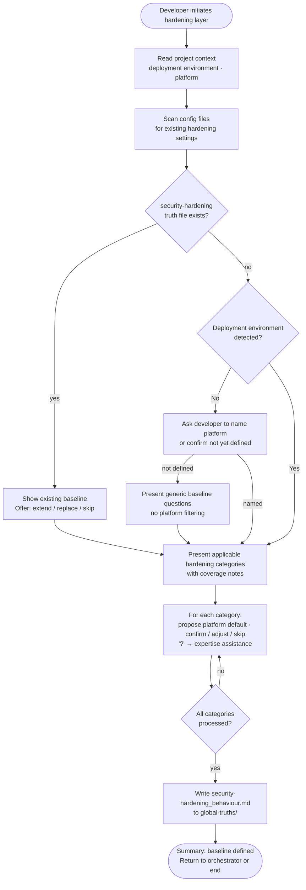

# Behaviour: Define Deployment Hardening Baseline

## Actor
Developer configuring the deploy-time security baseline for a project, invoked by the security module orchestrator or directly

## Preconditions
- Taproot is initialized in the project
- Security module skill is installed
- Project context record is available (deployment environment, platform) — or developer has accepted generic defaults

## Main Flow
1. Developer initiates the hardening layer configuration.
2. System reads the project context record to determine deployment environment and platform.
3. System scans existing configuration files (web server config, Dockerfile, Kubernetes manifests, cloud config, environment templates) for any hardening already in place and notes detected settings.
4. System presents the hardening categories — security headers, TLS requirements, least-privilege, secrets management, platform-specific hardening — filtering out categories not applicable to the deployment environment, and marking any with detected configuration.
5. For each applicable category, system proposes a platform-appropriate default baseline and asks the developer to confirm, adjust, or skip. Developer may select **[?] Get help** to request agent assistance before answering.
6. Developer confirms or adjusts the baseline for each category.
7. System writes `security-hardening_behaviour.md` to `taproot/global-truths/` containing the confirmed baseline settings and an agent checklist.
8. System presents a summary of the baseline defined and returns control to the security module orchestrator (or ends the session if invoked directly).

## Alternate Flows

### Hardening file already exists
- **Trigger:** `security-hardening_behaviour.md` already exists in `taproot/global-truths/`.
- **Steps:**
  1. System displays the existing baseline settings and checklist.
  2. System offers: extend with additional settings, replace, or skip.
  3. Developer chooses; system proceeds accordingly.

### Developer skips a category
- **Trigger:** Developer selects skip for a hardening category.
- **Steps:**
  1. System omits the category from the truth file.
  2. System notes the skipped category in the session summary.
  3. Session continues with the next category.

### No deployment environment detected
- **Trigger:** No deployment configuration files are found and project context does not name a platform.
- **Steps:**
  1. System notes no deployment environment was detected and asks the developer to describe their deployment platform or confirm it is not yet defined.
  2. If developer names a platform: system proceeds using defaults appropriate to that platform.
  3. If developer confirms no deployment target yet: system presents generic hardening baseline questions without platform-specific filtering.

### No project context available
- **Trigger:** No project context record exists and developer declined context discovery.
- **Steps:**
  1. System presents hardening category questions using generic defaults rather than platform-specific proposals.
  2. Developer answers each question without pre-filled suggestions.
  3. Session proceeds normally from step 6.

### Invoked directly
- **Trigger:** Developer invokes this sub-behaviour without going through the security module orchestrator.
- **Steps:**
  1. System runs the full main flow.
  2. After step 8, session ends — no orchestrator resumes.

### Developer requests expertise assistance
- **Trigger:** Developer selects **[?] Get help** at a hardening category question.
- **Steps:**
  1. System scans existing configuration files for evidence of current hardening settings.
  2. System draws on domain knowledge and presents a structured proposal: detected settings, a recommended baseline with reasoning, and one or two alternatives with trade-offs.
  3. Developer confirms the proposal, adjusts, or rejects and provides their own baseline.
  4. Confirmed answer is filled in and the session continues.

## Postconditions
- `security-hardening_behaviour.md` exists in `taproot/global-truths/` containing the confirmed deployment hardening baseline and an agent checklist
- Skipped or inapplicable categories are noted in the session summary

## Error Conditions
- **Global truths not writable**: System presents the baseline content and target file path so the developer can write it manually.

## Flow

## Related
- `taproot-modules/security/usecase.md` — parent behaviour: orchestrates all 5 security layers; invokes this sub-behaviour for the hardening layer
- `taproot-modules/security/ci-cd/usecase.md` — sibling: pipeline gates enforce scanning; hardening defines the baseline those gates verify against
- `taproot-modules/module-context-discovery/usecase.md` — produces the project context record consumed in step 2
- `human-integration/agent-expertise-assistance/usecase.md` — triggered when developer selects [?] at any hardening category question

## Acceptance Criteria

**AC-1: Full session — all applicable categories confirmed and truth file written**
- Given a project with a context record and no existing hardening truth file
- When developer confirms the baseline for all applicable hardening categories
- Then `security-hardening_behaviour.md` is written to `taproot/global-truths/` with the baseline settings and agent checklist

**AC-2: Platform-appropriate defaults proposed**
- Given a project context record that names the deployment platform
- When developer reaches a hardening category question
- Then system proposes a default appropriate to that platform rather than an open-ended question

**AC-3: Existing hardening file — extend or skip offered**
- Given `security-hardening_behaviour.md` already exists
- When developer initiates the hardening layer
- Then system displays the existing baseline and offers to extend, replace, or skip

**AC-4: Developer skips a category**
- Given a session in progress
- When developer skips a hardening category
- Then the category is omitted from the truth file and noted as unconfigured in the summary

**AC-5: Inapplicable categories filtered out**
- Given a project context record that identifies a deployment environment with no web server (e.g. a CLI tool)
- When developer initiates the hardening layer
- Then security headers and TLS categories are not presented

**AC-6: No deployment environment detected — developer prompted**
- Given no deployment configuration files are found and project context names no platform
- When developer initiates the hardening layer
- Then system asks the developer to name their deployment platform or confirm it is not yet defined

**AC-7: Developer requests expertise assistance**
- Given developer selects [?] Get help at a hardening category question
- When agent scans configuration files and proposes a baseline recommendation
- Then developer can confirm, adjust, or reject the proposal before the session continues

**AC-8: No project context — generic defaults used**
- Given no project context record exists
- When developer initiates the hardening layer
- Then system presents hardening questions using generic defaults without platform-specific filtering

## Status
- **State:** specified
- **Created:** 2026-04-12
- **Last reviewed:** 2026-04-12
