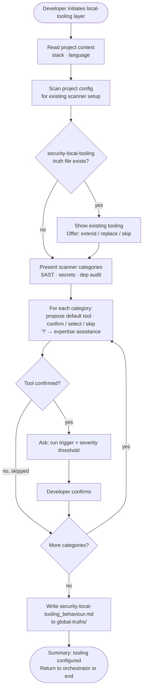

# Behaviour: Configure Local Security Tooling

## Actor
Developer configuring which security scanners the agent runs locally, invoked by the security module orchestrator or directly

## Preconditions
- Taproot is initialized in the project
- Security module skill is installed
- Project context record is available (stack, language) — or developer has accepted generic defaults

## Main Flow
1. Developer initiates the local-tooling layer configuration.
2. System reads the project context record to determine stack-appropriate tool defaults.
3. System scans existing project configuration (package scripts, pre-commit config, Makefile, CI config) for any scanner setup already in place and notes detected tooling.
4. System presents three scanner categories — SAST, secrets scanning, dependency audit — marking any with detected configuration.
5. For each category, system proposes a stack-appropriate default tool and asks the developer to confirm, select an alternative, or skip. Developer may select **[?] Get help** to request agent assistance before answering.
6. For each confirmed tool, system asks when it should run (pre-commit, on-demand, before PR) and what constitutes a blocking finding versus a warning.
7. Developer confirms the run trigger and severity threshold for each tool.
8. System writes `security-local-tooling_behaviour.md` to `taproot/global-truths/` containing the confirmed tool list, run triggers, and severity thresholds.
9. System presents a summary of tooling configured and returns control to the security module orchestrator (or ends the session if invoked directly).

## Alternate Flows

### Tooling file already exists
- **Trigger:** `security-local-tooling_behaviour.md` already exists in `taproot/global-truths/`.
- **Steps:**
  1. System displays the existing tool list, run triggers, and thresholds.
  2. System offers: extend with additional tools, replace, or skip.
  3. Developer chooses; system proceeds accordingly.

### Developer skips a scanner category
- **Trigger:** Developer selects skip for a scanner category.
- **Steps:**
  1. System omits the category from the truth file.
  2. System notes the skipped category in the session summary.
  3. Session continues with the next category.

### No project context available
- **Trigger:** No project context record exists and developer declined context discovery.
- **Steps:**
  1. System presents scanner category questions using generic defaults rather than stack-specific proposals.
  2. Developer selects tools and run triggers without pre-filled suggestions.
  3. Session proceeds normally from step 6.

### Invoked directly
- **Trigger:** Developer invokes this sub-behaviour without going through the security module orchestrator.
- **Steps:**
  1. System runs the full main flow.
  2. After step 9, session ends — no orchestrator resumes.

### Developer requests expertise assistance
- **Trigger:** Developer selects **[?] Get help** at a scanner category question.
- **Steps:**
  1. System scans the codebase and project configuration for evidence of existing tooling preferences.
  2. System draws on domain knowledge and presents a structured proposal: detected tooling, a recommended tool with reasoning, and one or two alternatives with trade-offs.
  3. Developer confirms the proposal, adjusts, or rejects and selects their own tool.
  4. Confirmed choice is filled in and the session continues.

## Postconditions
- `security-local-tooling_behaviour.md` exists in `taproot/global-truths/` containing the tool list, run triggers, and severity thresholds for each confirmed scanner category
- Skipped categories are noted as unconfigured in the session summary

## Error Conditions
- **Global truths not writable**: System presents the tooling content and target file path so the developer can write it manually.

## Flow

## Related
- `taproot-modules/security/usecase.md` — parent behaviour: orchestrates all 5 security layers; invokes this sub-behaviour for the local-tooling layer
- `taproot-modules/security/rules/usecase.md` — sibling: defines what the agent checks manually; this behaviour defines what tools the agent runs automatically
- `taproot-modules/module-context-discovery/usecase.md` — produces the project context record consumed in step 2
- `human-integration/agent-expertise-assistance/usecase.md` — triggered when developer selects [?] at any scanner category question

## Acceptance Criteria

**AC-1: Full session — all categories confirmed and truth file written**
- Given a project with a context record and no existing local-tooling truth file
- When developer confirms tools and run triggers for all three scanner categories
- Then `security-local-tooling_behaviour.md` is written to `taproot/global-truths/` with the tool list, run triggers, and severity thresholds

**AC-2: Stack-appropriate tool defaults proposed**
- Given a project context record that identifies the language and stack
- When developer reaches a scanner category question
- Then system proposes a tool appropriate to that stack rather than an open-ended question

**AC-3: Existing tooling file — extend or skip offered**
- Given `security-local-tooling_behaviour.md` already exists
- When developer initiates the local-tooling layer
- Then system displays existing tooling and offers to extend, replace, or skip

**AC-4: Developer skips a scanner category**
- Given a session in progress
- When developer skips a scanner category
- Then the category is omitted from the truth file and noted as unconfigured in the summary

**AC-5: Run trigger and severity threshold recorded per tool**
- Given developer confirms a tool for a scanner category
- When developer specifies when it runs and what constitutes a blocking finding
- Then the truth file records the run trigger and severity threshold alongside the tool name

**AC-6: Developer requests expertise assistance**
- Given developer selects [?] Get help at a scanner category question
- When agent scans the project and proposes a tool recommendation
- Then developer can confirm, adjust, or reject the proposal before the session continues

**AC-7: No project context — generic defaults used**
- Given no project context record exists
- When developer initiates the local-tooling layer
- Then system presents scanner questions using generic defaults without stack-specific proposals

## Status
- **State:** specified
- **Created:** 2026-04-12
- **Last reviewed:** 2026-04-12
