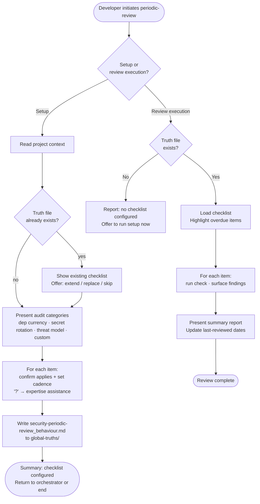

# Behaviour: Define and Run Periodic Security Review

## Actor
Developer configuring what the periodic security review covers (setup mode) or running the review against an established checklist (review mode)

## Preconditions
- Taproot is initialized in the project
- Security module skill is installed
- **Setup mode:** project context record is available (stack, deployment environment) — or developer has accepted generic defaults
- **Review mode:** `security-periodic-review_behaviour.md` exists in `taproot/global-truths/`

## Main Flow
*(Setup mode — invoked by the security module orchestrator)*

1. Developer initiates the periodic-review layer configuration.
2. System reads the project context record to determine applicable audit items.
3. System presents the standard audit categories — dependency currency, secret rotation, threat model refresh — and asks the developer to confirm which apply and add any project-specific items. Developer may select **[?] Get help** to request agent assistance before answering.
4. For each confirmed audit item, system asks the developer to specify the intended review cadence (e.g. monthly, before each release, quarterly).
5. Developer confirms the cadence for each item.
6. System writes `security-periodic-review_behaviour.md` to `taproot/global-truths/` containing the confirmed audit checklist, cadence for each item, and instructions for the agent to follow when executing the review.
7. System presents a summary of audit items configured and returns control to the security module orchestrator (or ends the session if invoked directly in setup mode).

## Alternate Flows

### Review execution — running the review
- **Trigger:** Developer invokes the periodic review behaviour standalone to actually run a review (not during module setup).
- **Steps:**
  1. System reads `security-periodic-review_behaviour.md` from `taproot/global-truths/` and loads the audit checklist.
  2. System presents the audit checklist with the last-reviewed date for each item (if recorded) and highlights items overdue based on their cadence.
  3. For each audit item, system works through the check — scanning deps for known vulnerabilities, checking secret rotation records, reviewing the threat model for significant changes since last review, and any project-specific items.
  4. System surfaces findings for each item: items that pass, items with findings (with details and suggested actions), and items that could not be assessed (with the reason).
  5. System presents a summary report: items reviewed, findings, suggested actions, and recommended next review date.
  6. System records the review date in `security-periodic-review_behaviour.md` for each completed item.

### Review file already exists (setup mode)
- **Trigger:** `security-periodic-review_behaviour.md` already exists when setup is initiated.
- **Steps:**
  1. System displays the existing audit checklist and cadence.
  2. System offers: extend with additional items, replace, or skip.
  3. Developer chooses; system proceeds accordingly.

### Developer skips an audit category (setup mode)
- **Trigger:** Developer declines an audit category during setup.
- **Steps:**
  1. System omits the category from the truth file.
  2. System notes the skipped category in the session summary.
  3. Session continues with the next category.

### Review file not found (review execution)
- **Trigger:** Developer invokes review execution but no `security-periodic-review_behaviour.md` exists.
- **Steps:**
  1. System reports that no periodic review checklist has been configured.
  2. System offers to run setup mode now to configure the checklist before proceeding.

### No project context available (setup mode)
- **Trigger:** No project context record exists and developer declined context discovery.
- **Steps:**
  1. System presents audit category questions using generic defaults rather than stack-specific proposals.
  2. Session proceeds normally from step 4.

### Developer requests expertise assistance (setup mode)
- **Trigger:** Developer selects **[?] Get help** at an audit category question.
- **Steps:**
  1. System scans the project for evidence relevant to the category (e.g. dependency files, secret usage patterns, existing threat model docs).
  2. System draws on domain knowledge and presents a structured proposal: what was found, a recommended audit item with reasoning, and suggested cadence.
  3. Developer confirms the proposal, adjusts, or rejects and provides their own answer.
  4. Confirmed answer is filled in and the session continues.

## Postconditions
- **Setup mode:** `security-periodic-review_behaviour.md` exists in `taproot/global-truths/` with the confirmed audit checklist, cadence per item, and agent execution instructions
- **Review mode:** a summary report has been presented; last-reviewed dates updated in the truth file for each completed item

## Error Conditions
- **Global truths not writable (setup)**: System presents the checklist content and target file path so the developer can write it manually.
- **Audit item cannot be assessed (review)**: System notes the item, records the reason it could not be assessed, and continues with remaining items — it does not block the review.

## Flow

## Related
- `taproot-modules/security/usecase.md` — parent behaviour: orchestrates all 5 security layers; invokes this sub-behaviour in setup mode for the periodic-review layer
- `taproot-modules/security/local-tooling/usecase.md` — sibling: local tools (dep audit, secrets scan) are run as part of review execution
- `taproot-modules/module-context-discovery/usecase.md` — produces the project context record consumed during setup
- `human-integration/agent-expertise-assistance/usecase.md` — triggered when developer selects [?] during setup

## Acceptance Criteria

**AC-1: Setup — checklist configured and truth file written**
- Given a project with a context record and no existing periodic-review truth file
- When developer confirms audit items and cadence for all applicable categories
- Then `security-periodic-review_behaviour.md` is written to `taproot/global-truths/` with the checklist, cadence per item, and agent execution instructions

**AC-2: Setup — existing checklist offered for extension**
- Given `security-periodic-review_behaviour.md` already exists
- When developer initiates the periodic-review layer in setup mode
- Then system displays the existing checklist and offers to extend, replace, or skip

**AC-3: Review execution — findings surfaced per item**
- Given `security-periodic-review_behaviour.md` exists with a configured checklist
- When developer invokes the periodic review in review execution mode
- Then system works through each audit item and presents a summary report with findings and suggested actions

**AC-4: Review execution — overdue items highlighted**
- Given audit items have a configured cadence and last-reviewed dates recorded
- When developer invokes the periodic review
- Then system highlights items whose last-reviewed date exceeds their cadence before beginning the review

**AC-5: Review execution — last-reviewed dates updated**
- Given a review execution session completes
- When system presents the summary report
- Then last-reviewed dates are updated in `security-periodic-review_behaviour.md` for each completed item

**AC-6: Review execution — no checklist configured**
- Given `security-periodic-review_behaviour.md` does not exist
- When developer invokes review execution
- Then system reports no checklist is configured and offers to run setup now

**AC-7: Setup — developer skips an audit category**
- Given a setup session in progress
- When developer skips an audit category
- Then the category is omitted from the truth file and noted as unconfigured in the summary

**AC-8: Audit item cannot be assessed — review continues**
- Given a review execution session in progress
- When an audit item cannot be assessed (e.g. no dependency file found)
- Then system records the reason and continues with remaining items without blocking the review

## Status
- **State:** specified
- **Created:** 2026-04-12
- **Last reviewed:** 2026-04-12
