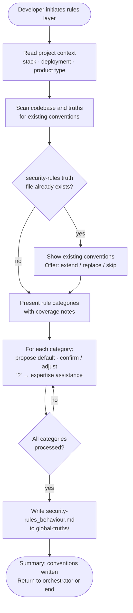

# Behaviour: Define Secure Coding Rules

## Actor
Developer configuring secure coding conventions for a project, invoked by the security module orchestrator or directly

## Preconditions
- Taproot is initialized in the project
- Security module skill is installed
- Project context record is available (stack, deployment environment, product type) — or developer has accepted generic defaults

## Main Flow
1. Developer initiates the rules layer configuration.
2. System reads the project context record to determine stack-appropriate defaults.
3. System scans existing global truths and codebase for any existing secure coding conventions and notes discovered coverage.
4. System presents the rule categories — input validation, authentication, authorisation, secrets handling, data protection, error handling, logging, injection prevention, dependency hygiene — marking any with existing coverage.
5. For each category, system proposes a stack-appropriate default convention and asks the developer to confirm, adjust, or override. Developer may select **[?] Get help** to request agent assistance before answering.
6. Developer confirms or adjusts the convention for each category.
7. System writes `security-rules_behaviour.md` to `taproot/global-truths/` containing all confirmed conventions and an agent checklist.
8. System presents a summary of conventions written and returns control to the security module orchestrator (or ends the session if invoked directly).

## Alternate Flows

### Convention file already exists
- **Trigger:** `security-rules_behaviour.md` already exists in `taproot/global-truths/`.
- **Steps:**
  1. System displays the existing conventions and checklist.
  2. System offers: extend with new conventions, replace, or skip.
  3. Developer chooses; system proceeds accordingly.

### Developer skips a category
- **Trigger:** Developer selects skip for a rule category.
- **Steps:**
  1. System omits the category from the truth file.
  2. System notes the skipped category in the session summary.
  3. Session continues with the next category.

### No project context available
- **Trigger:** No project context record exists and developer declined context discovery.
- **Steps:**
  1. System presents rule category questions using generic defaults rather than stack-specific proposals.
  2. Developer answers each question without pre-filled suggestions.
  3. Session proceeds normally from step 6.

### Invoked directly
- **Trigger:** Developer invokes this sub-behaviour without going through the security module orchestrator.
- **Steps:**
  1. System runs the full main flow.
  2. After step 8, session ends — no orchestrator resumes.

### Developer requests expertise assistance
- **Trigger:** Developer selects **[?] Get help** at a rule category question.
- **Steps:**
  1. System scans the codebase for evidence relevant to the category (existing patterns, framework usage, configuration).
  2. System draws on domain knowledge for the category and presents a structured proposal: what the project already shows, a draft convention with reasoning, and one or two alternatives.
  3. Developer confirms the draft, adjusts wording, or rejects and provides their own answer.
  4. Confirmed answer is filled in and the session continues with the next category.

## Postconditions
- `security-rules_behaviour.md` exists in `taproot/global-truths/` containing conventions for all confirmed categories and an agent checklist
- Skipped categories are noted as unconfigured in the session summary

## Error Conditions
- **Global truths not writable**: System presents the convention content and target file path so the developer can write it manually.

## Flow

## Related
- `taproot-modules/security/usecase.md` — parent behaviour: orchestrates all 5 security layers; invokes this sub-behaviour for the rules layer
- `taproot-modules/module-context-discovery/usecase.md` — produces the project context record consumed in step 2
- `human-integration/agent-expertise-assistance/usecase.md` — triggered when developer selects [?] at any rule category question

## Acceptance Criteria

**AC-1: Full session — all categories confirmed and truth file written**
- Given a project with a context record and no existing security-rules truth file
- When developer works through all rule categories
- Then `security-rules_behaviour.md` is written to `taproot/global-truths/` with conventions and an agent checklist for each category

**AC-2: Stack-appropriate defaults proposed**
- Given a project context record that names the stack
- When developer reaches a rule category question
- Then system proposes a default convention appropriate to that stack rather than an open-ended question

**AC-3: Existing truth file — extend or skip offered**
- Given `security-rules_behaviour.md` already exists
- When developer initiates the rules layer
- Then system displays existing conventions and offers to extend, replace, or skip

**AC-4: Developer skips a category**
- Given a session in progress
- When developer skips a rule category
- Then the category is omitted from the truth file and noted as unconfigured in the summary

**AC-5: Developer requests expertise assistance**
- Given developer selects [?] Get help at a rule category question
- When agent scans the codebase and proposes a draft convention
- Then developer can confirm, adjust, or reject the draft before the session continues

**AC-6: No project context — generic defaults used**
- Given no project context record exists
- When developer initiates the rules layer
- Then system presents rule category questions using generic defaults without stack-specific proposals

## Status
- **State:** specified
- **Created:** 2026-04-12
- **Last reviewed:** 2026-04-12
