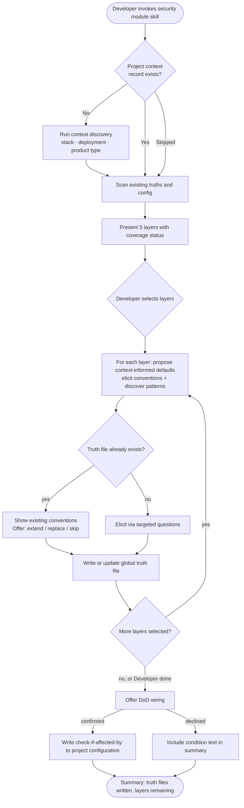

# Behaviour: Activate Security Module

## Actor
Developer (team lead or contributor) setting up security guidance for a project

## Preconditions
- Taproot is initialized in the project
- Developer has access to the codebase, its existing specs, and deployment configuration

## Main Flow
1. Developer invokes the security module skill.
2. System checks whether a project context record exists; if absent, system runs context discovery — asking about product type, target stack, and deployment environment — before proceeding.
3. System scans existing global truths, specs, and project configuration and reports which of the 5 security layers already have partial coverage.
4. System presents the 5 layers — rules, local-tooling, ci-cd, hardening, periodic-review — marking any with existing coverage.
5. Developer selects which layers to configure in this session (all or a subset).
6. For each selected layer, system asks targeted questions, uses the established project context to propose stack-appropriate defaults, and surfaces any existing conventions; developer reviews and confirms the elicited conventions.
7. System writes a scoped global truth file for each completed layer (e.g. `security-rules_behaviour.md`) containing conventions and an agent checklist.
8. If `check-if-affected-by: taproot-modules/security` is not already present in the project's `definitionOfDone`, system asks whether to wire it as a DoD condition in project configuration. If already wired, skip this step.
9. Developer confirms or declines.
10. System writes the condition to project configuration (if confirmed) and presents a summary of truth files written and layers remaining.

## Alternate Flows

### Layer already configured
- **Trigger:** A global truth file for the layer already exists.
- **Steps:**
  1. System displays the existing conventions and checklist for the layer.
  2. System offers: extend with new conventions, replace, or skip.
  3. Developer chooses; system proceeds accordingly.

### Partial session
- **Trigger:** Developer selects Done before all selected layers are completed.
- **Steps:**
  1. System writes global truth files for all completed layers.
  2. System records remaining layers as not yet configured.
  3. System notes the module can be re-invoked to continue with uncovered layers.

### DoD wiring declined
- **Trigger:** Developer declines the DoD wiring offer in step 8.
- **Steps:**
  1. System skips writing the DoD condition.
  2. System includes the condition text in the summary so developer can add it manually.

### DoD condition already wired — wiring offer suppressed
- **Trigger:** `check-if-affected-by: taproot-modules/security` is already present in the project's `definitionOfDone` when step 8 is reached.
- **Steps:**
  1. System skips the wiring offer entirely.
  2. System proceeds directly to the summary phase.

### Activated without project context
- **Trigger:** Developer skips or declines context discovery when prompted in step 2.
- **Steps:**
  1. System proceeds using generic defaults for layer questions.
  2. No project context record is written.
  3. System notes that context can be established at any future session by re-invoking the skill.

## Postconditions
- A scoped global truth file exists for each completed layer, containing conventions and a checklist for agents to apply at DoR/DoD time
- DoD condition is wired in project configuration (if developer confirmed in step 9)

## Error Conditions
- **Taproot not initialized**: System stops with a message directing the developer to run `taproot init` before activating any module.
- **Project configuration not writable**: System presents the DoD condition text and target file path so the developer can add it manually.

## Flow

## Behaviours <!-- taproot-managed -->
- [Define Secure Coding Rules](./rules/usecase.md)
- [Configure Local Security Tooling](./local-tooling/usecase.md)
- [Configure CI/CD Security Gates](./ci-cd/usecase.md)
- [Define Deployment Hardening Baseline](./hardening/usecase.md)
- [Define and Run Periodic Security Review](./periodic-review/usecase.md)

## Related
- `taproot-modules/intent.md` — parent intent: optional module system goal and constraints
- `taproot-modules/module-context-discovery/usecase.md` — runs as a prerequisite step; produces the project context record this behaviour consumes
- `taproot-modules/user-experience/usecase.md` — sibling module; shares the same activation pattern and context record

## Acceptance Criteria

**AC-1: Full session — all layers configured and DoD wired**
- Given a taproot-initialized project with no existing security truths
- When developer invokes the security module skill and works through all 5 layers
- Then 5 global truth files are written and the DoD condition is added to project configuration

**AC-2: Layer already configured — extend or skip offered**
- Given a project where a security truth file already exists for one or more layers
- When developer invokes the skill and reaches an already-configured layer
- Then system shows existing conventions and offers to extend, replace, or skip

**AC-3: Partial session — developer stops early**
- Given a session in progress with some layers completed
- When developer selects Done before all layers are covered
- Then truth files are written for completed layers and remaining layers are noted as uncovered

**AC-4: DoD wiring declined**
- Given a session where at least one layer is configured
- When developer declines the DoD wiring offer
- Then no DoD condition is written and the condition text appears in the session summary

**AC-7: DoD wiring offer suppressed when condition already present**
- Given a session where at least one layer is configured
- And `check-if-affected-by: taproot-modules/security` is already present in the project's `definitionOfDone`
- When the session reaches step 8
- Then the wiring offer is skipped and the session proceeds to the summary

**AC-5: Taproot not initialized**
- Given a directory without taproot initialization
- When developer invokes the security module skill
- Then system stops with a message to initialize taproot first

**AC-6: Context discovery runs before layer selection on first invocation**
- Given no project context record exists
- When developer invokes the security module skill
- Then system runs context discovery before presenting the 5 security layers

## Implementations <!-- taproot-managed -->
- [Agent Skill — Security Module](./agent-skill/impl.md)

## Status
- **State:** implemented
- **Created:** 2026-04-12
- **Last reviewed:** 2026-04-16
