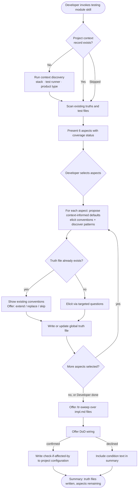

# Behaviour: Activate Testing Module

## Actor
Developer (team lead or contributor) setting up testing quality guidance for a project

## Preconditions
- Taproot is initialized in the project
- Developer has access to the codebase and its existing specs; a test suite may or may not exist — its absence does not block activation

## Main Flow
1. Developer invokes the testing module skill.
2. System checks whether a project context record exists; if absent, system runs context discovery — asking about product type, target stack, and test runner — before proceeding.
3. System scans existing global truths, specs, and test files and reports which of the 6 testing aspects already have partial coverage; also detects cross-module truth files that overlap with testing aspects (e.g. architecture module test structure conventions) and flags them alongside coverage status.
4. System presents the 6 aspects — test types, file structure, naming conventions, coverage thresholds, test data, mocking strategy — marking any with existing coverage.
5. Developer selects which aspects to configure in this session (all or a subset).
6. For each selected aspect, system asks targeted questions, uses the established project context to propose stack-appropriate defaults, and surfaces discovered patterns from existing test files; developer reviews and confirms the elicited conventions.
7. System writes a scoped global truth file for each completed aspect (e.g. `test-types_behaviour.md`) containing conventions and an agent checklist.
8. System offers the developer the option to run `/tr-sweep` over existing impl.md files to surface implementations that may not conform to the newly written conventions; developer accepts or skips.
9. System asks whether to wire `check-if-affected-by: taproot-modules/testing` as a DoD condition in project configuration.
10. Developer confirms or declines.
11. System writes the condition to project configuration (if confirmed) and presents a summary of truth files written and aspects remaining.

## Alternate Flows

### Aspect already configured
- **Trigger:** A global truth file for the aspect already exists.
- **Steps:**
  1. System displays the existing conventions and checklist for the aspect.
  2. System offers: extend with new conventions, replace, or skip.
  3. Developer chooses; system proceeds accordingly.

### Partial session
- **Trigger:** Developer selects Done before all selected aspects are completed.
- **Steps:**
  1. System writes global truth files for all completed aspects.
  2. System records remaining aspects as not yet configured.
  3. System notes the module can be re-invoked to continue with uncovered aspects.

### DoD wiring declined
- **Trigger:** Developer declines the DoD wiring offer in step 9.
- **Steps:**
  1. System skips writing the DoD condition.
  2. System includes the condition text in the summary so developer can add it manually.

### Activated without project context
- **Trigger:** Developer skips or declines context discovery when prompted in step 2.
- **Steps:**
  1. System proceeds using generic defaults for aspect questions.
  2. No project context record is written.
  3. System notes that context can be established at any future session by re-invoking the skill.

### No aspects selected
- **Trigger:** Developer selects no aspects in step 5.
- **Steps:**
  1. System notes: "No aspects selected — nothing to configure in this session."
  2. System presents next steps without proceeding to truth file authoring or DoD wiring.

### Architecture module test-structure overlap detected
- **Trigger:** System detects that a test structure global truth already exists (written by the architecture module's test structure/placement aspect).
- **Steps:**
  1. System displays the existing architecture-scoped test structure conventions.
  2. System notes: "The architecture module already captures where tests live — the testing module's file structure aspect can extend rather than replace this."
  3. System offers: extend with testing-specific conventions (naming patterns, runner config), replace, or skip the file structure aspect.

## Postconditions
- A scoped global truth file exists for each completed aspect, containing conventions and a checklist for agents to apply at DoR/DoD time
- DoD condition is wired in project configuration (if developer confirmed in step 10)

## Error Conditions
- **Taproot not initialized**: System stops with a message directing the developer to run `taproot init` before activating any module.
- **Truth file not writable**: System reports which aspect's truth file could not be written, preserves all successfully written files, and offers to retry or skip the failed aspect.
- **Project configuration not writable**: System presents the DoD condition text and target file path so the developer can add it manually.

## Flow

## Related
- `taproot-modules/intent.md` — parent intent: optional module system goal and constraints
- `taproot-modules/module-context-discovery/usecase.md` — runs as a prerequisite step; produces the project context record this behaviour consumes
- `taproot-modules/architecture/usecase.md` — sibling module; includes a test structure/placement aspect — testing module may extend rather than replace those conventions
- `taproot-modules/security/usecase.md` — sibling module; shares the same activation pattern and context record
- `quality-audit/audit/usecase.md` — ACs and NFRs in behaviour specs define *what* to test per scenario; this module defines *how* those tests are written (conventions, structure, tooling); both apply at implementation time

## Acceptance Criteria

**AC-1: Full session — all aspects configured and DoD wired**
- Given a taproot-initialized project with no existing testing truths
- When developer invokes the testing module skill and works through all 6 aspects
- Then 6 global truth files are written and the DoD condition is added to project configuration

**AC-2: Aspect already configured — extend or skip offered**
- Given a project where a testing truth file already exists for one or more aspects
- When developer invokes the skill and reaches an already-configured aspect
- Then system shows existing conventions and offers to extend, replace, or skip

**AC-3: Partial session — developer stops early**
- Given a session in progress with some aspects completed
- When developer selects Done before all aspects are covered
- Then truth files are written for completed aspects and remaining aspects are noted as uncovered

**AC-4: DoD wiring declined**
- Given a session where at least one aspect is configured
- When developer declines the DoD wiring offer
- Then no DoD condition is written and the condition text appears in the session summary

**AC-5: Taproot not initialized**
- Given a directory without taproot initialization
- When developer invokes the testing module skill
- Then system stops with a message to initialize taproot first

**AC-6: Context discovery runs before aspect selection on first invocation**
- Given no project context record exists
- When developer invokes the testing module skill
- Then system runs context discovery before presenting the 6 testing aspects

**AC-7: Architecture overlap detected — extend or skip offered**
- Given a project where the architecture module has already written test structure conventions
- When the developer reaches the file structure aspect
- Then system shows the existing architecture-scoped conventions and offers to extend rather than replace

**AC-8: /tr-sweep offered after truth files written**
- Given at least one global truth file has been written in the session
- When the aspect loop completes or developer signals Done
- Then system offers to run `/tr-sweep` over existing impl.md files before proceeding to wiring

## Notes

Aspect scope and DoD wiring for the implementing agent:

| Aspect | Scope | DoD |
|---|---|---|
| test-types | Which test kinds are used (unit, integration, e2e, contract, snapshot) and when each applies | ✓ all new code has tests of the appropriate type |
| file-structure | Where tests live relative to source; file naming patterns (`*.test.ts`, `__tests__/`) | ✓ test files land in the correct location with correct naming |
| naming-conventions | How `describe`/`it`/`test` blocks are worded; test file naming rules | ✓ test names follow conventions |
| coverage-thresholds | Project-wide minimum targets (lines, branches, functions); excluded paths; enforcement level. Per-behaviour NFR criteria take precedence when stricter — this aspect sets the floor. | ✓ coverage meets or exceeds thresholds |
| test-data | How test data is created and managed (factories, fixtures, builders, seeders vs inline literals) | ✓ test data follows conventions |
| mocking-strategy | What to mock vs. use real; boundary placement; approved mock libraries | ✓ mocks used only at approved boundaries |

## Status
- **State:** specified
- **Created:** 2026-04-12
- **Last reviewed:** 2026-04-12
