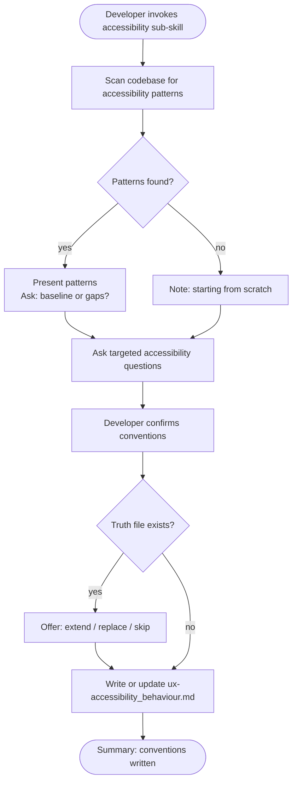

# Behaviour: Define Accessibility Conventions

## Actor
Developer setting up UX conventions for a project

## Preconditions
- The user-experience module is active in the project
- Developer has access to existing specs and codebase

## Main Flow
1. Developer invokes the accessibility sub-skill.
2. System scans existing specs and code for accessibility patterns: keyboard navigation order, focus management, ARIA roles and labels, colour contrast choices, motion/animation settings, screen-reader announcements, and skip-navigation links.
3. System reports discovered patterns and asks targeted questions:
   - What keyboard navigation model is used? (tab order, arrow-key navigation, shortcut keys)
   - How is focus managed when content changes dynamically? (modals, drawers, inline expansions)
   - What contrast level is the target? (and for which content categories — body text, UI controls, decorative elements)
   - How are motion and animation handled for users who prefer reduced motion?
   - How are meaningful images and icons labelled for assistive technology?
   - What surfaces require screen-reader live region announcements? (status updates, form errors, async results)
4. Developer answers for their surface type and confirms conventions.
5. System writes `ux-accessibility_behaviour.md` containing conventions and an agent checklist covering: keyboard model, focus management, contrast targets, motion preferences, labelling, and live regions.

## Alternate Flows

### Patterns discovered in codebase
- **Trigger:** System finds existing accessibility patterns in specs or code during step 2.
- **Steps:**
  1. System presents discovered patterns with source references.
  2. System asks whether to adopt as baseline or surface gaps.
  3. Developer confirms or adjusts.

### No patterns found
- **Trigger:** System finds no accessibility patterns.
- **Steps:**
  1. System notes no existing patterns and proceeds directly to elicitation questions.

### Truth file already exists
- **Trigger:** `ux-accessibility_behaviour.md` already exists.
- **Steps:**
  1. System shows current conventions and checklist.
  2. System offers: extend, replace, or skip.

## Postconditions
- `ux-accessibility_behaviour.md` exists in `taproot/global-truths/` with conventions and a checklist covering keyboard model, focus management, contrast targets, motion preferences, labelling, and live regions

## Error Conditions
- **Codebase scan fails**: System notes it could not scan and proceeds with elicitation questions only.

## Flow

## Related
- `taproot-modules/user-experience/usecase.md` — parent: UX module activation
- `taproot-modules/user-experience/input/usecase.md` — keyboard affordances and label conventions are shared between input and accessibility
- `taproot-modules/user-experience/language/usecase.md` — label text, alt text, and ARIA descriptions fall under both language and accessibility conventions
- `taproot-modules/user-experience/adaptation/usecase.md` — reduced-motion preferences are an adaptation dimension

## Acceptance Criteria

**AC-1: Conventions elicited and truth written**
- Given a project with no existing accessibility truth file
- When developer invokes the accessibility sub-skill and answers all questions
- Then `ux-accessibility_behaviour.md` is written with conventions and an agent checklist

**AC-2: Existing patterns adopted as baseline**
- Given a codebase with discoverable accessibility patterns
- When developer confirms them as the baseline
- Then discovered patterns are incorporated into the truth file

**AC-3: Truth file extended**
- Given an existing `ux-accessibility_behaviour.md`
- When developer chooses to extend
- Then new conventions are appended without removing existing ones

**AC-4: No patterns found — elicit from scratch**
- Given a codebase with no accessibility patterns
- When developer invokes the sub-skill
- Then system proceeds directly to elicitation questions

## Status
- **State:** specified
- **Created:** 2026-04-11
- **Last reviewed:** 2026-04-11
