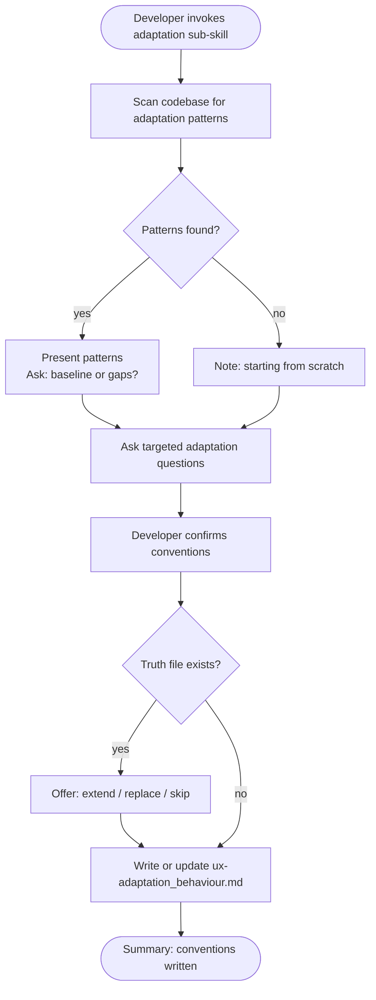

# Behaviour: Define Adaptation Conventions

## Actor
Developer setting up UX conventions for a project

## Preconditions
- The user-experience module is active in the project
- Developer has access to existing specs and codebase

## Main Flow
1. Developer invokes the adaptation sub-skill.
2. System scans existing specs and code for adaptation patterns: responsive breakpoints, environment detection, dark/light mode handling, device-specific behaviours, print styles, reduced-motion preferences, and high-contrast mode handling.
3. System reports discovered patterns and asks targeted questions:
   - What surfaces or environments does the product run in? (desktop browser, mobile browser, native app, CLI, terminal emulator)
   - How does the layout change between environments or screen sizes? (reflow, collapse, dedicated views)
   - Does the product support dark mode or high-contrast mode? How is the preference detected and applied?
   - How does the product behave in constrained environments? (low bandwidth, small screen, keyboard-only, limited colour)
   - What surface-specific capabilities are used and how are they handled when absent? (hover states, pointer precision, persistent storage)
4. Developer answers and confirms conventions.
5. System writes `ux-adaptation_behaviour.md` containing conventions and an agent checklist covering: environment targets, layout reflow rules, dark/high-contrast support, constrained-environment fallbacks, and capability detection.

## Alternate Flows

### Patterns discovered in codebase
- **Trigger:** System finds existing adaptation patterns in specs or code during step 2.
- **Steps:**
  1. System presents discovered patterns with source references.
  2. System asks whether to adopt as baseline or surface gaps.
  3. Developer confirms or adjusts.

### No patterns found
- **Trigger:** System finds no adaptation patterns.
- **Steps:**
  1. System notes no existing patterns and proceeds directly to elicitation questions.

### Truth file already exists
- **Trigger:** `ux-adaptation_behaviour.md` already exists.
- **Steps:**
  1. System shows current conventions and checklist.
  2. System offers: extend, replace, or skip.

## Postconditions
- `ux-adaptation_behaviour.md` exists in `taproot/global-truths/` with conventions and a checklist covering environment targets, layout reflow, dark/high-contrast support, constrained-environment fallbacks, and capability handling

## Error Conditions
- **Codebase scan fails**: System notes it could not scan and proceeds with elicitation questions only.

## Flow

## Related
- `taproot-modules/user-experience/usecase.md` — parent: UX module activation
- `taproot-modules/user-experience/presentation/usecase.md` — layout reflow and density choices are rooted in presentation conventions
- `taproot-modules/user-experience/accessibility/usecase.md` — reduced-motion and high-contrast preferences overlap with accessibility conventions

## Acceptance Criteria

**AC-1: Conventions elicited and truth written**
- Given a project with no existing adaptation truth file
- When developer invokes the adaptation sub-skill and answers all questions
- Then `ux-adaptation_behaviour.md` is written with conventions and an agent checklist

**AC-2: Existing patterns adopted as baseline**
- Given a codebase with discoverable adaptation patterns
- When developer confirms them as the baseline
- Then discovered patterns are incorporated into the truth file

**AC-3: Truth file extended**
- Given an existing `ux-adaptation_behaviour.md`
- When developer chooses to extend
- Then new conventions are appended without removing existing ones

**AC-4: No patterns found — elicit from scratch**
- Given a codebase with no adaptation patterns
- When developer invokes the sub-skill
- Then system proceeds directly to elicitation questions

## Status
- **State:** specified
- **Created:** 2026-04-11
- **Last reviewed:** 2026-04-11
