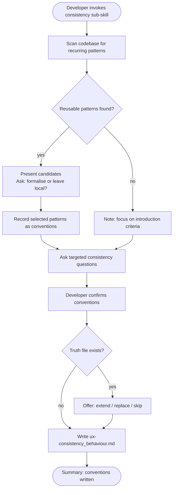

# Behaviour: Define Consistency Conventions

## Actor
Developer setting up UX conventions for a project

## Preconditions
- The user-experience module is active in the project
- Developer has access to existing specs and codebase

## Main Flow
1. Developer invokes the consistency sub-skill.
2. System scans existing specs and code for consistency patterns: shared component vocabulary, reused interaction patterns, cross-surface alignments, and documented deviations from established patterns.
3. System reports discovered patterns and asks targeted questions:
   - Which interaction patterns appear in multiple places and should be extracted as shared conventions? (e.g. confirm-before-delete, inline edit, multi-select with bulk actions)
   - How are deliberate deviations from established patterns documented and justified?
   - Which patterns differ between surfaces (CLI vs GUI, mobile vs desktop) — and is that intentional?
   - When should a new pattern be introduced vs adapting an existing one?
   - How is pattern drift detected and surfaced during implementation?
4. Developer answers and confirms conventions.
5. System writes `ux-consistency_behaviour.md` containing conventions and an agent checklist covering: shared-pattern vocabulary, deviation documentation, cross-surface alignment rules, pattern-introduction criteria, and drift-detection guidance.

## Alternate Flows

### Patterns discovered in codebase
- **Trigger:** System finds recurring patterns in specs or code during step 2.
- **Steps:**
  1. System presents candidate shared patterns with source references and usage frequency.
  2. System asks which should be formalised as conventions vs left as local patterns.
  3. Developer decides; selected patterns are recorded in the truth file.

### No reusable patterns found
- **Trigger:** System finds no recurring patterns worth extracting.
- **Steps:**
  1. System notes this and focuses elicitation on criteria for when patterns should be shared.

### Truth file already exists
- **Trigger:** `ux-consistency_behaviour.md` already exists.
- **Steps:**
  1. System shows current conventions and checklist.
  2. System offers: extend, replace, or skip.

## Postconditions
- `ux-consistency_behaviour.md` exists in `taproot/global-truths/` with conventions and a checklist covering shared-pattern vocabulary, deviation documentation, cross-surface alignment, pattern-introduction criteria, and drift detection

## Error Conditions
- **Codebase scan fails**: System notes it could not scan and proceeds with elicitation questions only.

## Flow

## Related
- `taproot-modules/user-experience/usecase.md` — parent: UX module activation
- `taproot-modules/user-experience/presentation/usecase.md` — presentation patterns are the primary source material for consistency formalisation
- `taproot-modules/user-experience/orientation/usecase.md` — orientation patterns (empty states, breadcrumbs) are common candidates for shared conventions
- `taproot-modules/user-experience/flow/usecase.md` — flow patterns (confirm-before-destroy, step sequences) frequently surface as cross-surface conventions

## Acceptance Criteria

**AC-1: Conventions elicited and truth written**
- Given a project with no existing consistency truth file
- When developer invokes the consistency sub-skill and answers all questions
- Then `ux-consistency_behaviour.md` is written with conventions and an agent checklist

**AC-2: Recurring patterns formalised**
- Given a codebase with discoverable recurring patterns
- When developer selects which to formalise
- Then selected patterns are recorded as shared conventions in the truth file

**AC-3: Truth file extended**
- Given an existing `ux-consistency_behaviour.md`
- When developer chooses to extend
- Then new conventions are appended without removing existing ones

**AC-4: No reusable patterns found — criteria-focused elicitation**
- Given a codebase with no recurring patterns
- When developer invokes the sub-skill
- Then system focuses elicitation on criteria for when patterns should become shared conventions

## Status
- **State:** specified
- **Created:** 2026-04-11
- **Last reviewed:** 2026-04-11
