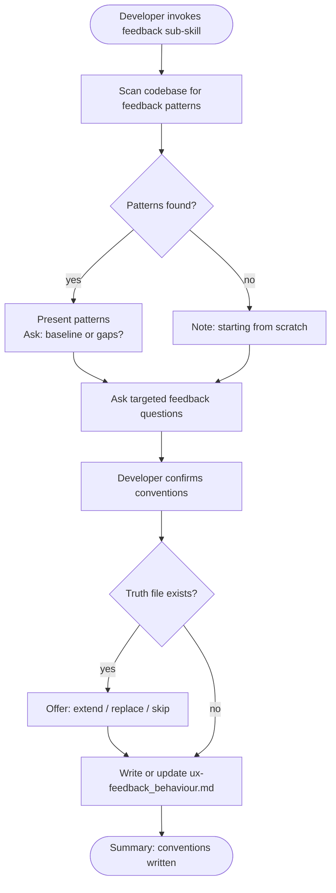

# Behaviour: Define Feedback Conventions

## Actor
Developer setting up UX conventions for a project

## Preconditions
- The user-experience module is active in the project
- Developer has access to existing specs and codebase

## Main Flow
1. Developer invokes the feedback sub-skill.
2. System scans existing specs and code for feedback patterns: success messages, error messages, inline validation, progress indicators, loading states, toast/banner notifications, empty result sets, and system-level alerts.
3. System reports discovered patterns and asks targeted questions:
   - How are success outcomes communicated? (inline confirmation, toast, redirect with message)
   - How are errors surfaced — at field level, form level, page level, or system level?
   - What does a long-running operation look like to the user? (spinner, progress bar, estimated time, background with notification)
   - How are recoverable errors distinguished from fatal ones?
   - When does the system show a warning vs an error vs informational feedback?
   - How are partial successes (some items succeeded, some failed) communicated?
4. Developer answers for their surface type and confirms conventions.
5. System writes `ux-feedback_behaviour.md` containing conventions and an agent checklist covering: success/error/warning hierarchy, loading states, inline vs global errors, and partial-outcome handling.

## Alternate Flows

### Patterns discovered in codebase
- **Trigger:** System finds existing feedback patterns in specs or code during step 2.
- **Steps:**
  1. System presents discovered patterns with source references.
  2. System asks whether to adopt as baseline or surface gaps.
  3. Developer confirms or adjusts.

### No patterns found
- **Trigger:** System finds no feedback patterns in the codebase.
- **Steps:**
  1. System notes no existing patterns and proceeds directly to elicitation questions.

### Truth file already exists
- **Trigger:** `ux-feedback_behaviour.md` already exists.
- **Steps:**
  1. System shows current conventions and checklist.
  2. System offers: extend, replace, or skip.

## Postconditions
- `ux-feedback_behaviour.md` exists in `taproot/global-truths/` with conventions and a checklist covering the success/error/warning hierarchy, loading states, and partial-outcome handling

## Error Conditions
- **Codebase scan fails**: System notes it could not scan and proceeds with elicitation questions only.

## Flow

## Related
- `taproot-modules/user-experience/usecase.md` — parent: UX module activation
- `taproot-modules/user-experience/flow/usecase.md` — flow transitions produce feedback signals; conventions should align
- `taproot-modules/user-experience/language/usecase.md` — error and success message copy tone is governed by language conventions

## Acceptance Criteria

**AC-1: Conventions elicited and truth written**
- Given a project with no existing feedback truth file
- When developer invokes the feedback sub-skill and answers all questions
- Then `ux-feedback_behaviour.md` is written with conventions and an agent checklist

**AC-2: Existing patterns adopted as baseline**
- Given a codebase with discoverable feedback patterns
- When developer confirms them as the baseline
- Then discovered patterns are incorporated into the truth file

**AC-3: Truth file extended**
- Given an existing `ux-feedback_behaviour.md`
- When developer chooses to extend
- Then new conventions are appended without removing existing ones

**AC-4: No patterns found — elicit from scratch**
- Given a codebase with no feedback patterns
- When developer invokes the sub-skill
- Then system proceeds directly to elicitation questions

## Status
- **State:** specified
- **Created:** 2026-04-11
- **Last reviewed:** 2026-04-11
