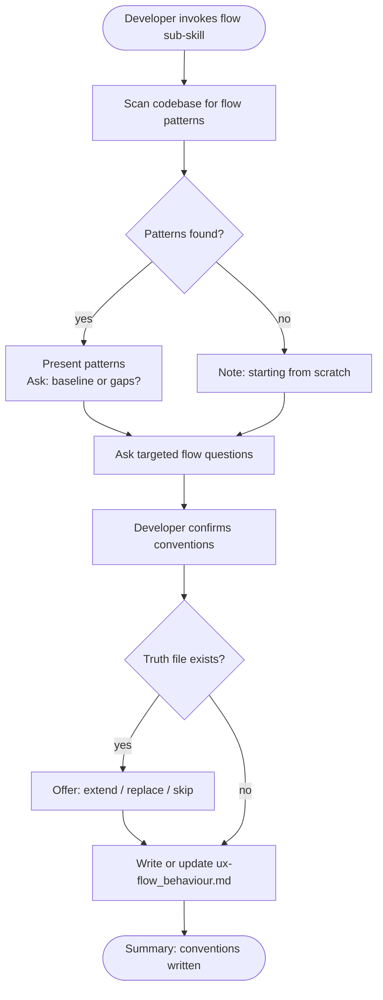

# Behaviour: Define Flow Conventions

## Actor
Developer setting up UX conventions for a project

## Preconditions
- The user-experience module is active in the project
- Developer has access to existing specs and codebase

## Main Flow
1. Developer invokes the flow sub-skill.
2. System scans existing specs and code for flow patterns: navigation structures, multi-step task sequences, cancellation paths, back/forward behaviour, progress indicators for long operations, and confirmation gates before destructive actions.
3. System reports discovered patterns and asks targeted questions:
   - How does the user move between areas or steps? (menus, tabs, wizard steps, command sequences)
   - What happens when the user cancels mid-task — is progress preserved or discarded?
   - How are multi-step tasks communicated? (step count, progress bar, breadcrumb trail)
   - When does the system ask for confirmation before a destructive or irreversible action?
   - How does the system behave when the user navigates away unexpectedly?
4. Developer answers for their surface type and confirms conventions.
5. System writes `ux-flow_behaviour.md` containing conventions and an agent checklist covering: navigation model, cancellation behaviour, multi-step signposting, and destructive-action confirmation.

## Alternate Flows

### Patterns discovered in codebase
- **Trigger:** System finds existing flow patterns in specs or code during step 2.
- **Steps:**
  1. System presents discovered patterns with source references.
  2. System asks whether to adopt as baseline or surface gaps.
  3. Developer confirms or adjusts; conventions are incorporated.

### No patterns found
- **Trigger:** System finds no flow patterns in the codebase.
- **Steps:**
  1. System notes no existing patterns and proceeds directly to elicitation questions.

### Truth file already exists
- **Trigger:** `ux-flow_behaviour.md` already exists.
- **Steps:**
  1. System shows current conventions and checklist.
  2. System offers: extend, replace, or skip.

## Postconditions
- `ux-flow_behaviour.md` exists in `taproot/global-truths/` with conventions and a checklist covering navigation model, cancellation, multi-step signposting, and destructive-action confirmation

## Error Conditions
- **Codebase scan fails**: System notes it could not scan and proceeds with elicitation questions only.

## Flow

## Related
- `taproot-modules/user-experience/usecase.md` — parent: UX module activation
- `taproot-modules/user-experience/orientation/usecase.md` — orientation establishes context; flow defines movement through it
- `taproot-modules/user-experience/feedback/usecase.md` — flow transitions often trigger feedback signals (progress, completion)

## Acceptance Criteria

**AC-1: Conventions elicited and truth written**
- Given a project with no existing flow truth file
- When developer invokes the flow sub-skill and answers all questions
- Then `ux-flow_behaviour.md` is written with conventions and an agent checklist

**AC-2: Existing patterns adopted as baseline**
- Given a codebase with discoverable flow patterns
- When developer confirms them as the baseline
- Then discovered patterns are incorporated into the truth file

**AC-3: Truth file extended**
- Given an existing `ux-flow_behaviour.md`
- When developer chooses to extend
- Then new conventions are appended without removing existing ones

**AC-4: No patterns found — elicit from scratch**
- Given a codebase with no flow patterns
- When developer invokes the sub-skill
- Then system proceeds directly to elicitation questions

## Status
- **State:** specified
- **Created:** 2026-04-11
- **Last reviewed:** 2026-04-11
