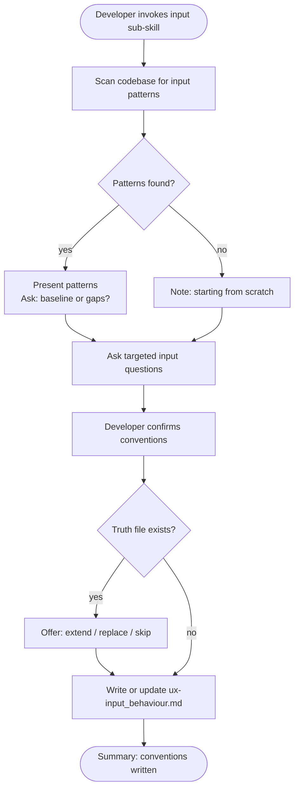

# Behaviour: Define Input Conventions

## Actor
Developer setting up UX conventions for a project

## Preconditions
- The user-experience module is active in the project
- Developer has access to existing specs and codebase

## Main Flow
1. Developer invokes the input sub-skill.
2. System scans existing specs and code for input patterns: form layouts, field labelling, placeholder text, default values, inline validation timing, error placement, keyboard shortcuts, drag-and-drop affordances, and confirmation patterns.
3. System reports discovered patterns and asks targeted questions:
   - When is validation shown — on blur, on submit, or as the user types?
   - How are required vs optional fields distinguished?
   - What are the defaults for text inputs, selections, and toggles — explicit defaults or empty?
   - How are keyboard shortcuts documented and discoverable?
   - How does the system handle destructive inputs (deleting, clearing, overwriting)?
   - How are complex inputs (file upload, rich text, multi-select) handled across surfaces?
4. Developer answers for their surface type and confirms conventions.
5. System writes `ux-input_behaviour.md` containing conventions and an agent checklist covering: validation timing, required/optional signalling, default values, keyboard affordances, and destructive-input confirmation.

## Alternate Flows

### Patterns discovered in codebase
- **Trigger:** System finds existing input patterns in specs or code during step 2.
- **Steps:**
  1. System presents discovered patterns with source references.
  2. System asks whether to adopt as baseline or surface gaps.
  3. Developer confirms or adjusts.

### No patterns found
- **Trigger:** System finds no input patterns in the codebase.
- **Steps:**
  1. System notes no existing patterns and proceeds directly to elicitation questions.

### Truth file already exists
- **Trigger:** `ux-input_behaviour.md` already exists.
- **Steps:**
  1. System shows current conventions and checklist.
  2. System offers: extend, replace, or skip.

## Postconditions
- `ux-input_behaviour.md` exists in `taproot/global-truths/` with conventions and a checklist covering validation timing, required/optional signalling, defaults, keyboard affordances, and destructive-input handling

## Error Conditions
- **Codebase scan fails**: System notes it could not scan and proceeds with elicitation questions only.

## Flow

## Related
- `taproot-modules/user-experience/usecase.md` — parent: UX module activation
- `taproot-modules/user-experience/feedback/usecase.md` — input validation triggers feedback; conventions must align on error placement and timing
- `taproot-modules/user-experience/accessibility/usecase.md` — keyboard affordances and label conventions overlap with accessibility requirements

## Acceptance Criteria

**AC-1: Conventions elicited and truth written**
- Given a project with no existing input truth file
- When developer invokes the input sub-skill and answers all questions
- Then `ux-input_behaviour.md` is written with conventions and an agent checklist

**AC-2: Existing patterns adopted as baseline**
- Given a codebase with discoverable input patterns
- When developer confirms them as the baseline
- Then discovered patterns are incorporated into the truth file

**AC-3: Truth file extended**
- Given an existing `ux-input_behaviour.md`
- When developer chooses to extend
- Then new conventions are appended without removing existing ones

**AC-4: No patterns found — elicit from scratch**
- Given a codebase with no input patterns
- When developer invokes the sub-skill
- Then system proceeds directly to elicitation questions

## Status
- **State:** specified
- **Created:** 2026-04-11
- **Last reviewed:** 2026-04-11
