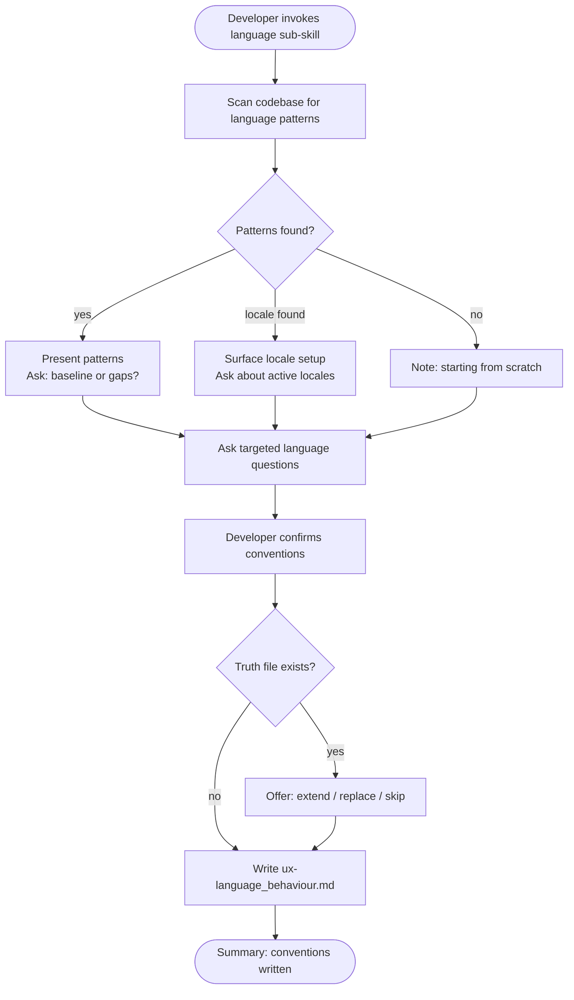

# Behaviour: Define Language Conventions

## Actor
Developer setting up UX conventions for a project

## Preconditions
- The user-experience module is active in the project
- Developer has access to existing specs and codebase

## Main Flow
1. Developer invokes the language sub-skill.
2. System scans existing specs and code for language patterns: button labels, error message copy, placeholder text, empty-state messages, confirmation prompts, tooltip text, and any locale or translation structures.
3. System reports discovered patterns and asks targeted questions:
   - What is the copy tone? (friendly/casual, professional/formal, technical/precise, terse)
   - What terminology is preferred — and what terms are off-limits or deprecated?
   - Does the product support multiple locales or languages? If so, how are strings managed?
   - How are variable-length strings handled where space is constrained? (truncation, wrapping, abbreviation rules)
   - How are plurals, counts, and units formatted? ("1 item" vs "1 items", "500ms" vs "0.5 seconds")
   - How are dates, times, and numbers formatted, and do they follow locale conventions?
4. Developer answers for their surface type and confirms conventions.
5. System writes `ux-language_behaviour.md` containing conventions and an agent checklist covering: copy tone, canonical terminology, locale handling, variable-length text rules, and pluralization/formatting.

## Alternate Flows

### Patterns discovered in codebase
- **Trigger:** System finds existing language or copy patterns in specs or code during step 2.
- **Steps:**
  1. System presents discovered patterns with source references.
  2. System asks whether to adopt as baseline or surface gaps.
  3. Developer confirms or adjusts.

### Locale structures found
- **Trigger:** System finds locale/i18n structures in the codebase (translation files, locale config).
- **Steps:**
  1. System surfaces the locale setup and asks which locales are active and whether conventions differ per locale.
  2. Developer confirms; locale-specific rules are captured in the truth file.

### No patterns found
- **Trigger:** System finds no language patterns.
- **Steps:**
  1. System notes no existing patterns and proceeds directly to elicitation questions.

### Truth file already exists
- **Trigger:** `ux-language_behaviour.md` already exists.
- **Steps:**
  1. System shows current conventions and checklist.
  2. System offers: extend, replace, or skip.

## Postconditions
- `ux-language_behaviour.md` exists in `taproot/global-truths/` with conventions and a checklist covering copy tone, canonical terminology, locale handling, variable-length text rules, and formatting conventions

## Error Conditions
- **Codebase scan fails**: System notes it could not scan and proceeds with elicitation questions only.

## Flow

## Related
- `taproot-modules/user-experience/usecase.md` — parent: UX module activation
- `taproot-modules/user-experience/feedback/usecase.md` — error and success message copy must follow language tone conventions
- `taproot-modules/user-experience/accessibility/usecase.md` — label text, alt text, and ARIA descriptions are governed by both language and accessibility conventions

## Acceptance Criteria

**AC-1: Conventions elicited and truth written**
- Given a project with no existing language truth file
- When developer invokes the language sub-skill and answers all questions
- Then `ux-language_behaviour.md` is written with conventions and an agent checklist

**AC-2: Locale structures adopted**
- Given a codebase with locale or i18n structures
- When developer confirms the active locales and rules
- Then locale-specific conventions are captured in the truth file

**AC-3: Truth file extended**
- Given an existing `ux-language_behaviour.md`
- When developer chooses to extend
- Then new conventions are appended without removing existing ones

**AC-4: No patterns found — elicit from scratch**
- Given a codebase with no language patterns
- When developer invokes the sub-skill
- Then system proceeds directly to elicitation questions

## Status
- **State:** specified
- **Created:** 2026-04-11
- **Last reviewed:** 2026-04-11
