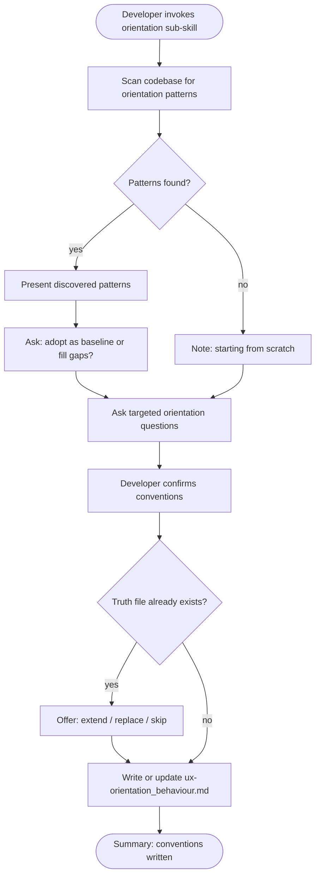

# Behaviour: Define Orientation Conventions

## Actor
Developer setting up UX conventions for a project

## Preconditions
- The user-experience module is active in the project
- Developer has access to existing specs and codebase

## Main Flow
1. Developer invokes the orientation sub-skill.
2. System scans existing specs and code for orientation patterns: onboarding flows, empty states, breadcrumbs, page titles, help text, first-run vs returning-user experiences, and context indicators.
3. System reports discovered patterns and asks targeted questions:
   - How does the user know where they are? (breadcrumbs, titles, active-state indicators)
   - What does an empty state look like — no data, no results, first run?
   - How is a new user oriented on first arrival vs a returning user?
   - Where and how is help or guidance surfaced?
   - How are dead ends (no results, permission denied) communicated?
4. Developer answers for their surface type (CLI, web, mobile, desktop) and confirms conventions.
5. System writes `ux-orientation_behaviour.md` containing the elicited conventions and an agent checklist covering: empty states, context indicators, onboarding signals, and help placement.

## Alternate Flows

### Patterns discovered in codebase
- **Trigger:** System finds existing orientation patterns in specs or code during step 2.
- **Steps:**
  1. System presents discovered patterns with source references.
  2. System asks: "Should these be the baseline conventions, or are there gaps to fill?"
  3. Developer confirms or adjusts; system incorporates into the truth file.

### No patterns found
- **Trigger:** System finds no orientation patterns in the codebase.
- **Steps:**
  1. System notes no existing patterns and proceeds directly to elicitation questions.
  2. Developer answers from scratch; conventions are captured entirely through dialogue.

### Truth file already exists
- **Trigger:** `ux-orientation_behaviour.md` already exists.
- **Steps:**
  1. System shows current conventions and checklist.
  2. System offers: extend, replace, or skip.
  3. Developer chooses; system acts accordingly.

## Postconditions
- `ux-orientation_behaviour.md` exists in `taproot/global-truths/` with conventions and a checklist covering empty states, context indicators, onboarding, and help placement

## Error Conditions
- **Codebase scan fails**: System notes it could not scan and proceeds with elicitation questions only.

## Flow

## Related
- `taproot-modules/user-experience/usecase.md` — parent: UX module activation that orchestrates this sub-skill
- `taproot-modules/user-experience/flow/usecase.md` — shares context: orientation establishes where the user is; flow defines where they go next

## Acceptance Criteria

**AC-1: Conventions elicited and truth written**
- Given a project with no existing orientation truth file
- When developer invokes the orientation sub-skill and answers all questions
- Then `ux-orientation_behaviour.md` is written with conventions and an agent checklist

**AC-2: Existing patterns adopted as baseline**
- Given a codebase with discoverable orientation patterns
- When developer confirms them as the baseline during the discovery step
- Then discovered patterns are incorporated into the truth file

**AC-3: Truth file extended**
- Given an existing `ux-orientation_behaviour.md`
- When developer invokes the sub-skill and chooses to extend
- Then new conventions are appended without removing existing ones

**AC-4: No patterns found — elicit from scratch**
- Given a codebase with no orientation patterns
- When developer invokes the sub-skill
- Then system proceeds directly to elicitation questions and produces a truth file from the answers

## Status
- **State:** specified
- **Created:** 2026-04-11
- **Last reviewed:** 2026-04-11
