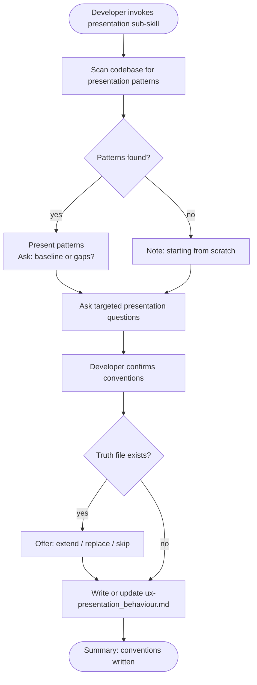

# Behaviour: Define Presentation Conventions

## Actor
Developer setting up UX conventions for a project

## Preconditions
- The user-experience module is active in the project
- Developer has access to existing specs and codebase

## Main Flow
1. Developer invokes the presentation sub-skill.
2. System scans existing specs and code for presentation patterns: layout structures, information hierarchy, content density, grouping conventions, typographic scale, spacing rhythm, list vs card vs grid choices, and progressive disclosure patterns.
3. System reports discovered patterns and asks targeted questions:
   - What is the primary layout structure? (single column, sidebar, grid, command-line output)
   - How is information hierarchy communicated? (headings, weight, indentation, colour)
   - When is information collapsed or hidden behind progressive disclosure? (expandable sections, tooltips, detail views)
   - How dense is the default view — compact, comfortable, or spacious?
   - What distinguishes primary content from secondary or supporting content?
   - How are lists, grids, and card views chosen for presenting collections?
4. Developer answers for their surface type and confirms conventions.
5. System writes `ux-presentation_behaviour.md` containing conventions and an agent checklist covering: layout structure, information hierarchy signals, density defaults, progressive disclosure triggers, and collection display choices.

## Alternate Flows

### Patterns discovered in codebase
- **Trigger:** System finds existing presentation patterns in specs or code during step 2.
- **Steps:**
  1. System presents discovered patterns with source references.
  2. System asks whether to adopt as baseline or surface gaps.
  3. Developer confirms or adjusts.

### No patterns found
- **Trigger:** System finds no presentation patterns in the codebase.
- **Steps:**
  1. System notes no existing patterns and proceeds directly to elicitation questions.

### Truth file already exists
- **Trigger:** `ux-presentation_behaviour.md` already exists.
- **Steps:**
  1. System shows current conventions and checklist.
  2. System offers: extend, replace, or skip.

## Postconditions
- `ux-presentation_behaviour.md` exists in `taproot/global-truths/` with conventions and a checklist covering layout structure, hierarchy signals, density, progressive disclosure, and collection display

## Error Conditions
- **Codebase scan fails**: System notes it could not scan and proceeds with elicitation questions only.

## Flow

## Related
- `taproot-modules/user-experience/usecase.md` — parent: UX module activation
- `taproot-modules/user-experience/consistency/usecase.md` — presentation patterns are the primary source of consistency tokens; the two sub-skills share surface-pattern vocabulary
- `taproot-modules/user-experience/adaptation/usecase.md` — presentation choices adapt across screen sizes and environments; conventions must align

## Acceptance Criteria

**AC-1: Conventions elicited and truth written**
- Given a project with no existing presentation truth file
- When developer invokes the presentation sub-skill and answers all questions
- Then `ux-presentation_behaviour.md` is written with conventions and an agent checklist

**AC-2: Existing patterns adopted as baseline**
- Given a codebase with discoverable presentation patterns
- When developer confirms them as the baseline
- Then discovered patterns are incorporated into the truth file

**AC-3: Truth file extended**
- Given an existing `ux-presentation_behaviour.md`
- When developer chooses to extend
- Then new conventions are appended without removing existing ones

**AC-4: No patterns found — elicit from scratch**
- Given a codebase with no presentation patterns
- When developer invokes the sub-skill
- Then system proceeds directly to elicitation questions

## Status
- **State:** specified
- **Created:** 2026-04-11
- **Last reviewed:** 2026-04-11
