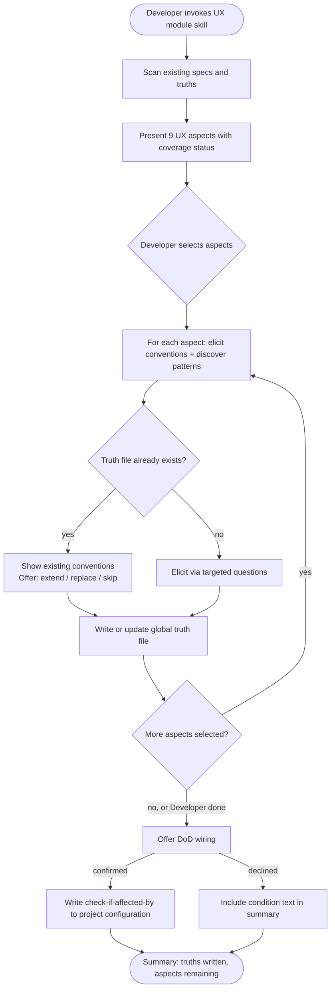

# Behaviour: Activate UX Module

## Actor
Developer (team lead or contributor) setting up UX quality guidance for a project

## Preconditions
- Taproot is initialized in the project
- Developer has access to the codebase and its existing specs

## Main Flow
1. Developer invokes the user-experience module skill.
2. System scans existing specs, code, and global truths and reports which of the 9 UX aspects already have partial coverage.
3. System presents the 9 aspects — orientation, flow, feedback, input, presentation, language, accessibility, adaptation, consistency — marking any with existing coverage.
4. Developer selects which aspects to define in this session (all or a subset).
5. For each selected aspect, system asks targeted questions and surfaces discovered patterns from the codebase; developer reviews and confirms the elicited conventions.
6. System writes a scoped global truth file for each completed aspect (e.g., `ux-orientation_behaviour.md`) containing conventions and an agent checklist.
7. System asks whether to wire `check-if-affected-by: taproot-modules/user-experience` as a DoD condition in project configuration.
8. Developer confirms or declines.
9. System writes the condition to project configuration (if confirmed) and presents a summary of truths written and aspects remaining.

## Alternate Flows

### Aspect already defined
- **Trigger:** A global truth file for the aspect already exists.
- **Steps:**
  1. System displays the existing conventions and checklist for the aspect.
  2. System offers: extend with new conventions, replace, or skip.
  3. Developer chooses; system proceeds accordingly.

### Partial session
- **Trigger:** Developer selects Done before all selected aspects are completed.
- **Steps:**
  1. System writes global truth files for all completed aspects.
  2. System records remaining aspects as not yet defined.
  3. System notes the module can be re-invoked to continue with uncovered aspects.

### DoD wiring declined
- **Trigger:** Developer declines the DoD wiring offer in step 7.
- **Steps:**
  1. System skips writing the DoD condition.
  2. System includes the condition text in the summary so developer can add it manually.

## Postconditions
- A scoped global truth file exists for each completed aspect, containing conventions and a checklist for agents to apply at DoR/DoD time
- DoD condition is wired in project configuration (if developer confirmed in step 8)

## Error Conditions
- **Taproot not initialized**: System stops with a message directing the developer to run `taproot init` before activating any module.
- **Project configuration not writable**: System presents the DoD condition text and target file path so the developer can add it manually.

## Flow

## Behaviours <!-- taproot-managed -->
- [Define Orientation Conventions](./orientation/usecase.md)
- [Define Flow Conventions](./flow/usecase.md)
- [Define Feedback Conventions](./feedback/usecase.md)
- [Define Input Conventions](./input/usecase.md)
- [Define Presentation Conventions](./presentation/usecase.md)
- [Define Language Conventions](./language/usecase.md)
- [Define Accessibility Conventions](./accessibility/usecase.md)
- [Define Adaptation Conventions](./adaptation/usecase.md)
- [Define Consistency Conventions](./consistency/usecase.md)

## Related
- `taproot-modules/intent.md` — parent intent: optional module system goal and constraints

## Acceptance Criteria

**AC-1: Full session — all aspects defined and DoD wired**
- Given a taproot-initialized project with no existing UX truths
- When developer invokes the UX module skill and works through all 9 aspects
- Then 9 global truth files are written and the DoD condition is added to project configuration

**AC-2: Aspect already defined — extend or skip offered**
- Given a project where a UX truth file already exists for one or more aspects
- When developer invokes the skill and reaches an already-defined aspect
- Then system shows existing conventions and offers to extend, replace, or skip

**AC-3: Partial session — developer stops early**
- Given a session in progress with some aspects completed
- When developer selects Done before all aspects are covered
- Then truths are written for completed aspects and remaining aspects are noted as uncovered

**AC-4: DoD wiring declined**
- Given a session where at least one aspect is defined
- When developer declines the DoD wiring offer
- Then no DoD condition is written and the condition text appears in the session summary

**AC-5: Taproot not initialized**
- Given a directory without taproot initialization
- When developer invokes the UX module skill
- Then system stops with a message to initialize taproot first

## Status
- **State:** specified
- **Created:** 2026-04-11
- **Last reviewed:** 2026-04-11
