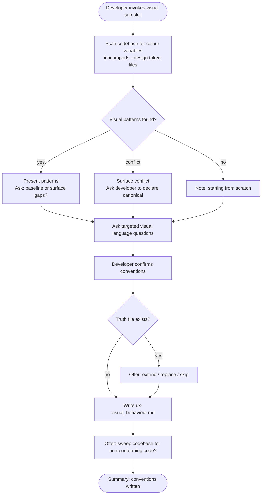

# Behaviour: Define Visual Language Conventions

## Actor
Developer setting up UX conventions for a project

## Preconditions
- The user-experience module is active in the project
- Developer has access to existing specs, codebase, and design assets

## Main Flow
1. Developer invokes the visual sub-skill.
2. System scans existing specs, code, and asset files for visual language patterns: colour variable declarations, icon imports or references, and design token files.
3. System reports discovered patterns and asks targeted questions:
   - What are the brand, neutral-scale, and accent colours? (hex, rgb, or hsl values)
   - What are the canonical token names for these colours? (CSS custom properties, JS/TS design token keys, or Tailwind config names — define them now if not yet established)
   - How are semantic colours defined? (error, warning, success, info, disabled states)
   - Does the project support dark mode, light mode, or both? If both, how do colour tokens adapt between modes?
   - What icon set or library is the project using? (e.g. Heroicons, Lucide, Material Icons, Phosphor, custom SVGs)
   - What iconography style is preferred? (outlined, filled, duotone, rounded, sharp)
   - How is icon sizing determined? (fixed scale such as 16/20/24 px, context-dependent, or responsive)
   - Are there colour or icon conventions that differ by surface (CLI vs web vs mobile)?
4. Developer answers and confirms conventions.
5. System writes `ux-visual_behaviour.md` containing conventions and an agent checklist covering: colour palette, semantic colour tokens, dark/light mode rules, icon set selection, iconography style, and sizing conventions. System then offers: "Sweep the codebase for code that may not conform to these visual conventions?" **[A]** Yes, run `/tr-sweep` · **[S]** Skip

## Alternate Flows

### Visual assets discovered in codebase
- **Trigger:** System finds existing colour variables, design tokens, or icon imports during step 2.
- **Steps:**
  1. System presents discovered tokens and icon references with source file locations.
  2. System asks whether to adopt as the baseline or surface gaps between discovered usage and desired conventions.
  3. Developer confirms or adjusts; confirmed patterns become the baseline for the truth file.

### Conflicting colour usage found
- **Trigger:** System finds two or more incompatible colour definitions for the same token during step 2.
- **Steps:**
  1. System surfaces the conflict with source file references for each definition.
  2. System asks developer to declare which usage is canonical.
  3. Developer's declaration is recorded; system proceeds with the confirmed baseline.

### No visual patterns found
- **Trigger:** System finds no colour variables or icon references in the codebase.
- **Steps:**
  1. System notes no existing patterns and proceeds directly to elicitation questions.

### Truth file already exists
- **Trigger:** `ux-visual_behaviour.md` already exists in `taproot/global-truths/`.
- **Steps:**
  1. System displays the existing conventions and checklist.
  2. System offers: extend with new conventions, replace, or skip.

### Dark/light mode token mapping deferred
- **Trigger:** Developer confirms both modes are supported but cannot specify token adaptation rules during the session.
- **Steps:**
  1. System records the supported modes.
  2. System writes the truth file with confirmed conventions and marks dark/light mode token mapping as `TODO`.

### Partial session — one domain deferred
- **Trigger:** Developer confirms conventions for one domain (colour or icons) but cannot decide the other during the session.
- **Steps:**
  1. System writes the confirmed domain's conventions to `ux-visual_behaviour.md`, marking the deferred domain as `TODO` with a placeholder section.
  2. System notes the sub-skill can be re-invoked to complete the deferred domain.

## Postconditions
- `ux-visual_behaviour.md` exists in `taproot/global-truths/` with conventions and a checklist covering colour palette, semantic tokens, dark/light mode rules, icon set, iconography style, and sizing
- Developer is offered a sweep of the codebase against the newly written visual conventions

## Error Conditions
- **Codebase scan fails**: System notes it could not scan and proceeds with elicitation questions only.

## Flow

## Related
- `taproot-modules/user-experience/usecase.md` — parent: UX module activation
- `taproot-modules/user-experience/presentation/usecase.md` — presentation uses colour as a hierarchy signal; visual palette must align with those choices
- `taproot-modules/user-experience/consistency/usecase.md` — visual tokens (colour, icon set) are primary source material for cross-surface consistency
- `taproot-modules/user-experience/accessibility/usecase.md` — colour contrast ratios and icon accessibility depend on visual language choices made here
- `taproot-modules/user-experience/adaptation/usecase.md` — dark/light mode token adaptation and responsive icon sizing are adaptation concerns that consume the rules defined here; visual conventions define what tokens exist and their values; adaptation conventions define how and when those tokens are applied

## Acceptance Criteria

**AC-1: Conventions elicited and truth written**
- Given a project with no existing visual language truth file
- When developer invokes the visual sub-skill and answers all questions
- Then `ux-visual_behaviour.md` is written with conventions and an agent checklist

**AC-2: Existing visual assets adopted as baseline**
- Given a codebase with discoverable colour variables or icon references
- When developer confirms them as the baseline
- Then discovered patterns are incorporated into the truth file

**AC-3: Truth file extended**
- Given an existing `ux-visual_behaviour.md`
- When developer chooses to extend
- Then new conventions are appended without removing existing ones

**AC-4: No patterns found — elicit from scratch**
- Given a codebase with no existing visual patterns
- When developer invokes the sub-skill
- Then system proceeds directly to elicitation questions

**AC-5: Dark/light mode open item recorded**
- Given a project that supports both dark and light mode
- When developer cannot specify token adaptation rules during the session
- Then truth file is written with supported modes noted and token mapping marked as TODO

**AC-6: Partial session — one domain deferred**
- Given a developer who has colour conventions ready but no icon decisions made
- When developer confirms colour conventions and defers icon set selection
- Then `ux-visual_behaviour.md` is written with colour conventions and a TODO placeholder for the icon domain

## Implementations <!-- taproot-managed -->
- [Agent Skill — Visual Language Sub-skill](./agent-skill/impl.md)

## Status
- **State:** specified
- **Created:** 2026-04-12
- **Last reviewed:** 2026-04-12
