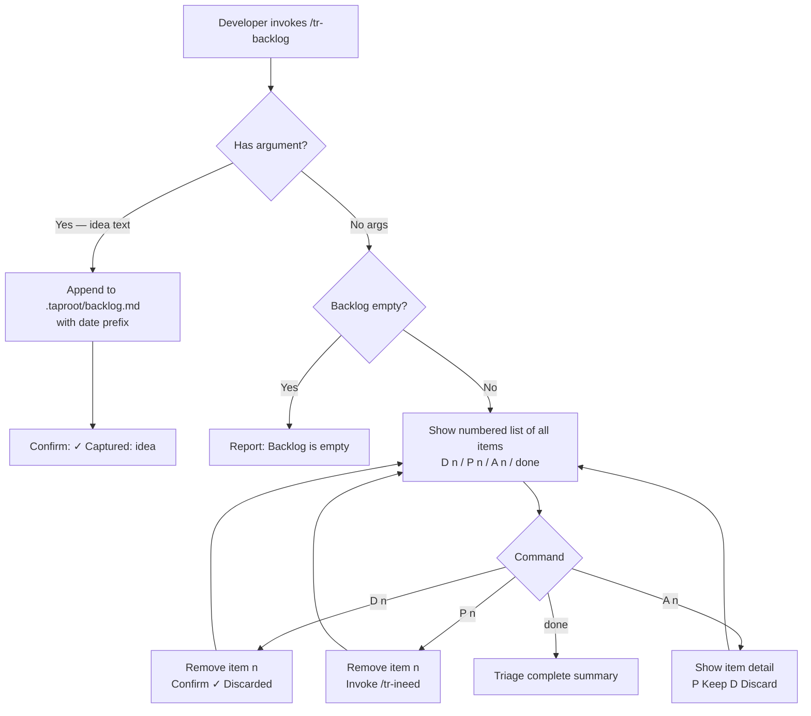

# Behaviour: Manage Backlog

## Actor
Developer — working mid-session who wants to capture an idea, finding, or deferred item instantly, or who wants to triage previously captured items.

## Preconditions
- A taproot project exists
- For triage mode: at least one item has been previously captured

## Main Flow

### Capture mode — invoked with an argument

1. Developer invokes `/tr-backlog <idea>` with a one-liner text describing the item.
2. Skill creates `.taproot/backlog.md` if absent, then appends the item with the current date as a prefix: `- [YYYY-MM-DD] <idea>`.
3. Skill confirms in one line: *"✓ Captured: <idea>"*
4. Developer returns to their current task — no further prompts.

### Triage mode — invoked with no argument

1. Developer invokes `/tr-backlog` with no arguments.
2. Skill reads `.taproot/backlog.md` and presents all standard items as a numbered list:
   ```
   Backlog — N items
    1. [YYYY-MM-DD] item text
    2. [YYYY-MM-DD] item text
   ...
   ```
3. Skill offers: `D <n>` discard · `P <n>` promote · `A <n>` analyze · `done` finish
4. Developer enters commands one at a time:
   - **`D <n>`** — item n is removed from the backlog. Skill confirms: *"✓ Discarded #n"*, then redisplays the updated numbered list.
   - **`P <n>`** — item n is removed from the backlog. Skill invokes `/tr-ineed` with the item text. On return, skill redisplays the updated numbered list.
   - **`A <n>`** — skill presents the full text of item n and asks: *"[P] Promote · [K] Keep · [D] Discard"*. After the choice is made, skill redisplays the updated numbered list.
   - **`done`** — triage ends. Items not acted on are kept implicitly.
5. After `done`: *"Triage complete — X discarded, Y promoted, Z kept."*

## Alternate Flows

### Empty backlog (triage mode)
- **Trigger:** Developer invokes `/tr-backlog` with no args but `.taproot/backlog.md` is absent or contains no items.
- **Steps:**
  1. Skill reports: *"Backlog is empty. Use `/tr-backlog <idea>` to capture something."*
  2. Skill stops — no triage loop.

### Developer exits triage early
- **Trigger:** Developer types `done` or something unrelated to the command prompt.
- **Steps:**
  1. Triage ends immediately.
  2. All items not explicitly acted on remain in `.taproot/backlog.md` unchanged.
  3. If any actions were taken, the triage summary is shown; otherwise the session continues naturally.

### Backlog contains non-standard lines
- **Trigger:** `.taproot/backlog.md` contains lines that do not match the `- [YYYY-MM-DD] <text>` format (headers, blank lines, free text added by hand).
- **Steps:**
  1. Skill processes only lines matching the standard format.
  2. Non-matching lines are preserved in the file and skipped during triage.
  3. After triage, skill notes: *"Skipped N non-standard line(s) — they remain in `.taproot/backlog.md`."*

### Developer changes mind during triage
- **Trigger:** Developer selects [P] to promote, but decides against it mid-discovery.
- **Steps:**
  1. `/tr-ineed` is invoked; developer can abandon the discovery there.
  2. Item has already been removed from the backlog — if the developer wants to keep it, they re-capture it with `/tr-backlog <idea>`.

## Postconditions
- **Capture mode:** The item appears in `.taproot/backlog.md` and is confirmed in the terminal.
- **Triage mode:** Items acted on via `D <n>` or `P <n>` are removed from `.taproot/backlog.md`; all others remain. Promoted items have been handed to `/tr-ineed`.

## Error Conditions
- **Invoked with no args and backlog file missing:** Treated as empty backlog — reports *"Backlog is empty"* and stops. No error.
- **Capture invoked with blank or whitespace argument:** Skill warns: *"Nothing to capture — provide a description."* and stops without writing to the file.

## Flow


## Related
- `../../../human-integration/route-requirement/usecase.md` — `/tr-ineed` is the promotion target; backlog items graduate into the hierarchy through it
- `../../../human-integration/browse-hierarchy-item/usecase.md` — browse is for reading hierarchy documents in depth; backlog is for capturing things before they're hierarchy items
- `../../../implementation-planning/extract-next-slice/usecase.md` — `/tr-plan` surfaces what's next from the hierarchy; backlog surfaces what's captured but not yet placed

## Acceptance Criteria

**AC-1: Instant capture**
- Given a developer is mid-session with an idea
- When they invoke `/tr-backlog <idea>` with a one-liner
- Then the item is captured and confirmed in one line — no follow-up response is required from the developer

**AC-2: Triage shows numbered list**
- Given `.taproot/backlog.md` contains at least one item
- When the developer invokes `/tr-backlog` with no arguments
- Then all items are presented as a numbered list with `D <n>`, `P <n>`, `A <n>`, and `done` options

**AC-3: D <n> discards item by index**
- Given triage is in progress and a numbered list is shown
- When the developer enters `D <n>`
- Then item n is removed from `.taproot/backlog.md` and the skill confirms *"✓ Discarded #n"*

~~**AC-4: Keep preserves item**~~ — deprecated; keeping is now implicit (no action = kept)

**AC-5: P <n> promotes item by index**
- Given triage is in progress and a numbered list is shown
- When the developer enters `P <n>`
- Then item n is removed from `.taproot/backlog.md` and `/tr-ineed` is invoked with its text

**AC-7: Triage completion summary on done**
- Given triage is in progress
- When the developer enters `done`
- Then the skill reports the count of discarded, promoted, and kept items

**AC-8: A <n> presents item detail with choices**
- Given triage is in progress and a numbered list is shown
- When the developer enters `A <n>`
- Then the skill presents the full text of item n and offers `[P] Promote · [K] Keep · [D] Discard`

**AC-6: Empty backlog**
- Given `.taproot/backlog.md` is absent or contains no items
- When the developer invokes `/tr-backlog` with no arguments
- Then the skill reports *"Backlog is empty"* and stops without error

## Implementations <!-- taproot-managed -->
- [Agent Skill](./agent-skill/impl.md)

## Status
- **State:** implemented
- **Created:** 2026-03-25
- **Last reviewed:** 2026-03-25

## Notes
- Storage is `.taproot/backlog.md` — a committed markdown list file inside the taproot config directory, not a throwaway file
- Capture must be instant: no prompts, no required fields, no confirmation questions
- Items promoted via `[P]` are removed from the backlog even if the developer abandons the `/tr-ineed` discovery — re-capture if needed
- Items are presented in FIFO order during triage (oldest first) — the order they were appended to `.taproot/backlog.md`
- A CLI companion (`taproot backlog "idea"`) for capturing without an agent session is a natural extension but is out of scope here
