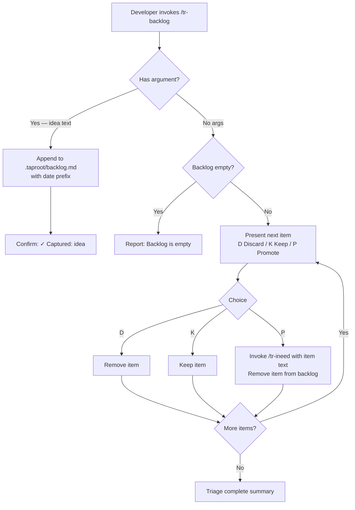

# Behaviour: Manage Backlog

## Actor
Developer — working mid-session who wants to capture an idea, finding, or deferred item instantly, or who wants to triage previously captured items.

## Preconditions
- A taproot project exists
- For triage mode: at least one item has been previously captured

## Main Flow

### Capture mode — invoked with an argument

1. Developer invokes `/tr-backlog <idea>` with a one-liner text describing the item.
2. Skill creates `.taproot/backlog.md` if absent, then appends the item with the current date as a prefix: `- [YYYY-MM-DD] <idea>`.
3. Skill confirms in one line: *"✓ Captured: <idea>"*
4. Developer returns to their current task — no further prompts.

### Triage mode — invoked with no argument

1. Developer invokes `/tr-backlog` with no arguments.
2. Skill reads `.taproot/backlog.md` and presents each item one at a time, showing the date and text.
3. For each item, skill offers: `[D] Discard   [K] Keep   [P] Promote to /tr-ineed`
4. Developer selects an action:
   - **[D] Discard** — item is removed from the backlog. Skill moves to the next item.
   - **[K] Keep** — item remains in the backlog unchanged. Skill moves to the next item.
   - **[P] Promote** — skill invokes `/tr-ineed` with the item text. Item is removed from the backlog after promotion is initiated.
5. After all items are processed: *"Triage complete — X kept, Y promoted, Z discarded."*

## Alternate Flows

### Empty backlog (triage mode)
- **Trigger:** Developer invokes `/tr-backlog` with no args but `.taproot/backlog.md` is absent or contains no items.
- **Steps:**
  1. Skill reports: *"Backlog is empty. Use `/tr-backlog <idea>` to capture something."*
  2. Skill stops — no triage loop.

### Developer exits triage early
- **Trigger:** Developer stops responding mid-triage or types something unrelated to the current item.
- **Steps:**
  1. Triage ends at the current item.
  2. All unprocessed items remain in `.taproot/backlog.md` unchanged.
  3. No summary is shown — the session continues naturally.

### Backlog contains non-standard lines
- **Trigger:** `.taproot/backlog.md` contains lines that do not match the `- [YYYY-MM-DD] <text>` format (headers, blank lines, free text added by hand).
- **Steps:**
  1. Skill processes only lines matching the standard format.
  2. Non-matching lines are preserved in the file and skipped during triage.
  3. After triage, skill notes: *"Skipped N non-standard line(s) — they remain in `.taproot/backlog.md`."*

### Developer changes mind during triage
- **Trigger:** Developer selects [P] to promote, but decides against it mid-discovery.
- **Steps:**
  1. `/tr-ineed` is invoked; developer can abandon the discovery there.
  2. Item has already been removed from the backlog — if the developer wants to keep it, they re-capture it with `/tr-backlog <idea>`.

## Postconditions
- **Capture mode:** The item appears in `.taproot/backlog.md` and is confirmed in the terminal.
- **Triage mode:** All processed items are either removed or remain in `.taproot/backlog.md`; promoted items have been handed to `/tr-ineed`.

## Error Conditions
- **Invoked with no args and backlog file missing:** Treated as empty backlog — reports *"Backlog is empty"* and stops. No error.
- **Capture invoked with blank or whitespace argument:** Skill warns: *"Nothing to capture — provide a description."* and stops without writing to the file.

## Flow

## Related
- `../../../human-integration/route-requirement/usecase.md` — `/tr-ineed` is the promotion target; backlog items graduate into the hierarchy through it
- `../../../human-integration/browse-hierarchy-item/usecase.md` — browse is for reading hierarchy documents in depth; backlog is for capturing things before they're hierarchy items
- `../../../implementation-planning/extract-next-slice/usecase.md` — `/tr-plan` surfaces what's next from the hierarchy; backlog surfaces what's captured but not yet placed

## Acceptance Criteria

**AC-1: Instant capture**
- Given a developer is mid-session with an idea
- When they invoke `/tr-backlog <idea>` with a one-liner
- Then the item is captured and confirmed in one line — no follow-up response is required from the developer

**AC-2: Triage loop**
- Given `.taproot/backlog.md` contains at least one item
- When the developer invokes `/tr-backlog` with no arguments
- Then each item is presented one at a time with `[D] Discard`, `[K] Keep`, and `[P] Promote` options

**AC-3: Discard removes item**
- Given triage is in progress and an item is displayed
- When the developer selects `[D]`
- Then the item is removed from `.taproot/backlog.md` and the next item is presented

**AC-4: Keep preserves item**
- Given triage is in progress and an item is displayed
- When the developer selects `[K]`
- Then the item remains in `.taproot/backlog.md` unchanged and the next item is presented

**AC-5: Promote hands off to /tr-ineed**
- Given triage is in progress and an item is displayed
- When the developer selects `[P]`
- Then `/tr-ineed` is invoked with the item text and the item is removed from `.taproot/backlog.md`

**AC-7: Triage completion summary**
- Given all items in the backlog have been processed
- When the last item is actioned
- Then the skill reports the count of kept, promoted, and discarded items

**AC-6: Empty backlog**
- Given `.taproot/backlog.md` is absent or contains no items
- When the developer invokes `/tr-backlog` with no arguments
- Then the skill reports *"Backlog is empty"* and stops without error

## Implementations <!-- taproot-managed -->

## Status
- **State:** specified
- **Created:** 2026-03-25
- **Last reviewed:** 2026-03-25

## Notes
- Storage is `.taproot/backlog.md` — a committed markdown list file inside the taproot config directory, not a throwaway file
- Capture must be instant: no prompts, no required fields, no confirmation questions
- Items promoted via `[P]` are removed from the backlog even if the developer abandons the `/tr-ineed` discovery — re-capture if needed
- Items are presented in FIFO order during triage (oldest first) — the order they were appended to `.taproot/backlog.md`
- A CLI companion (`taproot backlog "idea"`) for capturing without an agent session is a natural extension but is out of scope here
