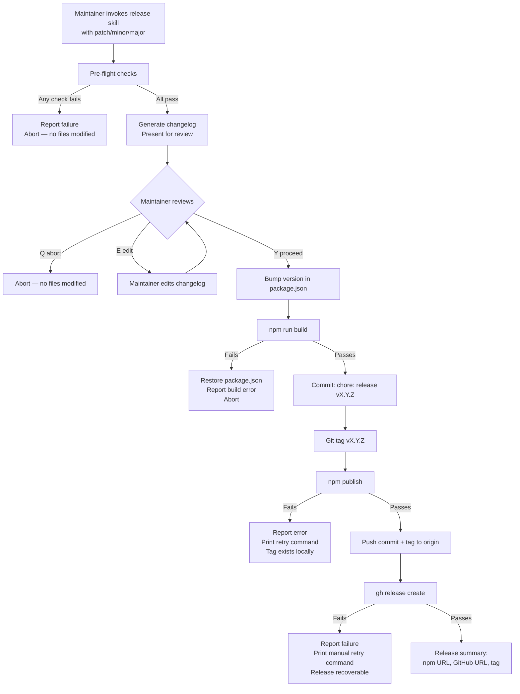

# Behaviour: Cut Release

## Actor
Maintainer cutting a new taproot release from the main branch

## Preconditions
- Maintainer is on the `main` branch with a clean working tree (no uncommitted changes)
- npm credentials are configured (`npm whoami` returns the publishing account)
- GitHub CLI is authenticated (`gh auth status` passes)
- A previous git tag exists to serve as the changelog baseline (or this is the first release)

## Main Flow
1. Maintainer invokes the release skill (e.g. `/tr-release patch|minor|major`) specifying the version bump type
2. **Pre-flight checks** — all of the following must pass before any files are modified:
   - `npm test` — all tests pass
   - `taproot validate-structure --path taproot/` — hierarchy is structurally valid
   - `taproot sync-check --path taproot/` — no `SPEC_UPDATED` or `IMPL_MISSING` violations
   - `taproot coverage` — every intent has at least one behaviour; every behaviour has at least one implementation
   - Git working tree is clean — no staged or unstaged changes
   - The computed next version (e.g. `v0.2.0`) does not already exist as a git tag
3. **Changelog generation** — maintainer reviews commits since the last tag; skill generates a structured changelog entry grouping commits by type (feat, fix, chore, docs)
4. **Version bump** — skill updates `version` in `package.json` to the new version
5. **Build** — `npm run build` produces fresh build artifacts in `dist/`
6. **Commit** — skill stages `package.json`, `dist/`, and `CHANGELOG.md` and commits with message `chore: release v<version>`
7. **Tag** — skill creates git tag `v<version>` on the release commit
8. **Publish** — `npm publish` publishes the package to the npm registry
9. **Push** — skill pushes the commit and tag to `origin/main`
10. **GitHub release** — skill creates a GitHub release via `gh release create v<version>` with the generated changelog as the body
11. Maintainer receives a release summary: npm URL, GitHub release URL, git tag

## Alternate Flows

### First release — no previous tag exists
- **Trigger:** No git tags found in the repository
- **Steps:**
  1. Changelog generation covers all commits in the repository history
  2. Changelog is presented to maintainer for review before proceeding
  3. Flow continues from step 4 (version bump) as normal

### Maintainer reviews and edits changelog before proceeding
- **Trigger:** Maintainer wants to adjust the generated changelog (remove noise commits, add context)
- **Steps:**
  1. Skill presents the generated changelog and pauses: "Review changelog — [E] edit, [Y] proceed, [Q] abort"
  2. If [E]: maintainer edits the changelog in their editor; skill re-reads the file
  3. If [Y]: flow continues from step 4
  4. If [Q]: release is aborted — no files have been modified

### Post-publish GitHub release fails
- **Trigger:** `gh release create` fails (auth error, network, or API limit) after npm publish and tag push have succeeded
- **Steps:**
  1. Skill reports: "npm published ✓, git tag pushed ✓ — GitHub release failed: `<error>`"
  2. Skill prints the exact `gh release create` command to retry manually
  3. Release is considered incomplete but recoverable — no rollback needed for npm/git

## Postconditions
- `package.json` version matches the released version
- `CHANGELOG.md` has an entry for the new version
- A git tag `v<version>` exists on `origin/main`
- The npm package is published and `npm install taproot@<version>` succeeds
- A GitHub release exists at `github.com/<owner>/taproot/releases/tag/v<version>` with the changelog body
- The release commit is the HEAD of `origin/main`

## Error Conditions
- **Pre-flight: tests fail** — skill reports failing test names and output; aborts before any file modification
- **Pre-flight: hierarchy violation found** — skill reports the specific `validate-structure` or `sync-check` error; aborts before any file modification
- **Pre-flight: working tree dirty** — skill lists uncommitted files and aborts; maintainer must commit or stash before releasing
- **Pre-flight: version tag already exists** — skill reports the duplicate tag and aborts; maintainer must choose a different version
- **Build fails** — `npm run build` exits non-zero after version bump commit has been staged but not yet committed — skill aborts, restores `package.json` to pre-bump version, reports the build error
- **npm publish fails (auth)** — tag exists locally but has not been pushed; skill reports the auth error and prints the retry command (`npm publish` from the tagged commit); maintainer resolves credentials and retries
- **npm publish fails (duplicate version)** — the version was already published (possibly from a prior partial attempt); skill detects the duplicate and reports it as a completed step, continues to push and GitHub release

## Flow

## Related
- `../../taproot-lifecycle/update-installation/usecase.md` — the consumer-side complement: users run `taproot update` after maintainer cuts a release; release and update are two sides of the same lifecycle
- `../../project-presentation/welcoming-readme/usecase.md` — README must accurately reflect the released version; a release is when the "currently implemented" state becomes public
- `../../requirements-completeness/coverage-report/usecase.md` — `taproot coverage` is a pre-flight check in this flow; coverage must pass before a release can proceed
- `../../hierarchy-integrity/validate-structure/usecase.md` — `taproot validate-structure` is a pre-flight check in this flow

## Acceptance Criteria

**AC-1: Release completes end-to-end from a clean main branch**
- Given the main branch is clean, all tests pass, and the hierarchy has no violations
- When the maintainer invokes the release skill with a valid bump type
- Then the npm package is published, a git tag exists, a GitHub release is created, and the release commit is HEAD of `origin/main`

**AC-2: Pre-flight failure aborts before any file is modified**
- Given any pre-flight check fails (tests, validate-structure, sync-check, or dirty working tree)
- When the failure is detected
- Then no files are modified, no commits are made, and the failure is reported with the specific check that failed

**AC-3: Version tag collision is detected before any action**
- Given the computed next version (e.g. `v0.2.0`) already exists as a git tag
- When the pre-flight check runs
- Then the release is aborted with a clear message before any files are modified

**AC-4: Changelog is shown for review before proceeding**
- Given commits exist since the last tag
- When the changelog is generated
- Then the maintainer sees the grouped changelog and must explicitly confirm before the version bump proceeds

**AC-5: Post-publish GitHub release failure is recoverable**
- Given npm publish and git tag push have succeeded but `gh release create` fails
- When the failure is detected
- Then the skill reports the npm and tag as complete, prints the exact retry command for the GitHub release, and does not attempt a rollback

**AC-6: Duplicate version publish is treated as already-done**
- Given a prior partial release attempt already published the version to npm
- When `npm publish` is run again for the same version
- Then the skill detects the duplicate, treats it as a completed step, and continues with push and GitHub release

**NFR-1: Pre-flight checks complete before any destructive action**
- Given any pre-flight check fails
- When the failure is detected
- Then zero files in the working tree have been modified — the state is identical to before the release was invoked

## Status
- **State:** specified
- **Created:** 2026-03-21
- **Last reviewed:** 2026-03-21
