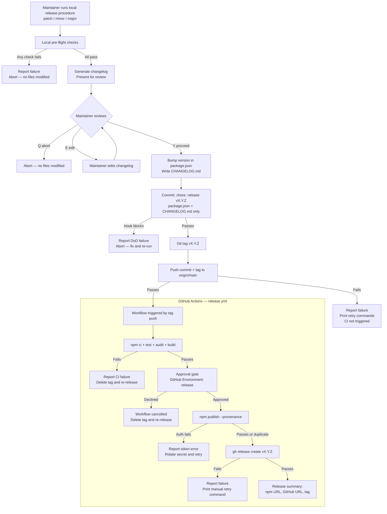

# Behaviour: Cut Release

## Actor
- **Maintainer** — runs the local phase (pre-flight, changelog, version bump, tag, push)
- **GitHub Actions** — runs the CI phase (build, publish, GitHub release) triggered by the tag push

## Preconditions
- Maintainer is on the `main` branch with a clean working tree (no uncommitted changes)
- GitHub CLI is authenticated locally (`gh auth status` passes) — used for monitoring workflow status
- A previous git tag exists to serve as the changelog baseline (or this is the first release)
- `.github/workflows/release.yml` exists and is configured to trigger on tag push
- A `release` GitHub Environment exists with:
  - The npm publish token stored as a secret (`NPM_TOKEN`)
  - The maintainer set as a required reviewer

## Main Flow

### Local phase (maintainer's machine)

1. Maintainer runs the release procedure specifying the version bump type (patch, minor, or major) — implemented as a local agent skill (`skills/release.md`) in the taproot repo, not distributed via `taproot update`
2. **Pre-flight checks** — all of the following must pass before any files are modified:
   - `git fetch origin` — verify local branch is not behind `origin/main`; remote must not have diverged
   - `npm test` — all tests pass
   - `npm audit --audit-level=high` — no high or critical CVEs in the dependency tree
   - `npm run build` — build succeeds (fast local verification before pushing)
   - `taproot validate-structure --path taproot/` — hierarchy is structurally valid
   - `taproot sync-check --path taproot/` — exits with code 0; `IMPL_STALE` warnings are tolerated; `IMPL_MISSING` errors block the release
   - `taproot coverage` — all implementations are in `complete` state; every intent has at least one behaviour; every behaviour has at least one implementation
   - Git working tree is clean — no staged or unstaged changes
   - The computed next version (e.g. `v0.2.0`) does not already exist as a git tag
3. **Changelog generation** — skill generates a structured changelog entry from commits since the last tag. Commits matching the taproot pattern `taproot(<scope>/<path>): message` are grouped under a **Taproot** section; non-taproot commits are grouped by conventional type (feat, fix, chore, docs). The generated entry is presented in the conversation; the maintainer responds [Y] to proceed, [E] to edit CHANGELOG.md directly (skill re-reads after edit), or [Q] to abort with no files modified. CHANGELOG.md is written to disk when the maintainer confirms [Y] — it is not written during generation, so [Q] leaves the working tree clean.
4. **Version bump** — skill updates `version` in `package.json` to the new version
5. **Commit** — skill stages `package.json` and `CHANGELOG.md` and commits with message `chore: release v<version>`. `dist/` is not staged — CI builds fresh from source. The release commit is a plain commit; the taproot pre-commit hook runs but no DoD conditions apply to `package.json` or `CHANGELOG.md`.
6. **Tag** — skill creates git tag `v<version>` on the release commit
7. **Push** — skill pushes the commit and tag to `origin/main`; this triggers the CI workflow

### CI phase (GitHub Actions — `release.yml`)

8. **CI checks** — workflow runs: `npm ci`, `npm test`, `npm audit --audit-level=high`, `npm run build`; any failure stops the workflow and notifies the maintainer
9. **Approval gate** — workflow pauses at the `release` GitHub Environment and sends the maintainer an approval request; nothing is published until the maintainer explicitly approves in the GitHub UI
10. **Publish** — `npm publish --provenance` using the `NPM_TOKEN` environment secret; GitHub Actions OIDC generates a provenance attestation linking the package to this specific workflow run
11. **GitHub release** — `gh release create v<version>` with the CHANGELOG.md entry as the release body
12. Maintainer receives a workflow completion notification with npm URL, GitHub release URL, and git tag

## Alternate Flows

### First release — no previous tag exists
- **Trigger:** No git tags found in the repository
- **Steps:**
  1. Changelog generation covers all commits in the repository history
  2. If `CHANGELOG.md` does not exist, skill creates it with an initial structure before generating the entry
  3. Changelog is presented to maintainer for review before proceeding
  4. Flow continues from step 4 (version bump) as normal

### Maintainer declines CI approval
- **Trigger:** Maintainer reviews the CI checks and declines the approval request in the GitHub UI
- **Steps:**
  1. Workflow is cancelled — npm publish does not run
  2. The git tag `v<version>` exists on `origin/main` but no package has been published
  3. Skill instructs maintainer to delete the tag before re-releasing: `git push origin :v<version> && git tag -d v<version>`
  4. Maintainer fixes the issue, then re-runs the release procedure from step 1

### Post-publish GitHub release creation fails
- **Trigger:** `gh release create` fails in CI (auth error, network, or API limit) after npm publish has succeeded
- **Steps:**
  1. Workflow reports: "npm published ✓ — GitHub release failed: `<error>`"
  2. Workflow prints the exact `gh release create` command to retry manually
  3. Release is considered incomplete but recoverable — no rollback needed for npm/git

## Postconditions
- `package.json` version matches the released version
- `CHANGELOG.md` has an entry for the new version
- A git tag `v<version>` exists on `origin/main`
- The npm package is published with provenance attestation and `npm install taproot@<version>` succeeds
- A GitHub release exists at `github.com/<owner>/taproot/releases/tag/v<version>` with the changelog body
- The release commit is the HEAD of `origin/main`

## Error Conditions
- **Pre-flight: remote diverged** — `git fetch origin` reveals local branch is behind `origin/main`; skill aborts with a list of remote-only commits; maintainer must `git pull` before releasing
- **Pre-flight: npm audit** — high or critical CVEs found; skill reports the vulnerable packages and aborts; maintainer must update or accept the risk before releasing
- **Pre-flight: tests fail** — skill reports failing test names and output; aborts before any file modification
- **Pre-flight: build fails** — `npm run build` exits non-zero; skill aborts before any file modification; maintainer fixes the build error and re-runs
- **Pre-flight: hierarchy violation** — skill reports the specific `validate-structure` or `sync-check` error; aborts before any file modification
- **Pre-flight: working tree dirty** — skill lists uncommitted files and aborts; maintainer must commit or stash before releasing
- **Pre-flight: version tag already exists** — skill reports the duplicate tag and aborts; maintainer must choose a different version
- **Commit blocked by pre-commit hook** — the taproot DoD hook returns a failing condition on the release commit; skill reports: "Release commit blocked by DoD condition: `<condition>`". No tag, no push. Maintainer resolves the condition and re-runs from step 1.
- **Push fails** — `git push` is rejected (non-fast-forward, auth, or network) after the local commit and tag have been created. Skill reports: "local commit ✓, local tag `v<version>` ✓ — push failed: `<error>`". Skill prints retry commands: `git push origin main && git push origin v<version>`. CI will not trigger until push succeeds.
- **CI checks fail** — `npm test`, `npm audit`, or `npm run build` fails in the workflow after the tag has been pushed. Workflow reports the failure. The tag exists on `origin/main` but npm has not been published. Maintainer must: fix the issue, delete the tag (`git push origin :v<version> && git tag -d v<version>`), and re-run the release from step 1.
- **npm publish fails (auth)** — `NPM_TOKEN` is invalid or expired; workflow reports the auth error. Maintainer rotates the token in the GitHub Environment secret and re-runs the workflow from the approval gate (no need to re-tag).
- **npm publish fails (duplicate version)** — the version was already published from a prior partial attempt; workflow detects the duplicate (exit code 1, message contains "cannot publish over") and treats it as a completed step, continues to GitHub release.

## Flow

## Related
- `../../taproot-lifecycle/update-installation/usecase.md` — the consumer-side complement: users run `taproot update` after maintainer cuts a release; release and update are two sides of the same lifecycle
- `../../project-presentation/welcoming-readme/usecase.md` — README must accurately reflect the released version; a release is when the "currently implemented" state becomes public
- `../../requirements-completeness/coverage-report/usecase.md` — `taproot coverage` is a pre-flight check in this flow
- `../../hierarchy-integrity/validate-structure/usecase.md` — `taproot validate-structure` is a pre-flight check in this flow

## Acceptance Criteria

**AC-1: Release completes end-to-end from a clean main branch**
- Given the main branch is clean, all local pre-flight checks pass, and origin/main is not ahead of local
- When the maintainer runs the local release procedure and approves the CI deployment
- Then the npm package is published with provenance, a git tag exists on origin/main, and a GitHub release is created

**AC-2: Pre-flight failure aborts before any file is modified**
- Given any local pre-flight check fails (tests, audit, build, validate-structure, sync-check, remote divergence, or dirty working tree)
- When the failure is detected
- Then no files are modified, no commits are made, and the failure is reported with the specific check that failed

**AC-3: Version tag collision is detected before any action**
- Given the computed next version (e.g. `v0.2.0`) already exists as a git tag
- When the pre-flight check runs
- Then the release is aborted with a clear message before any files are modified

**AC-4: Changelog is shown for review before proceeding**
- Given commits exist since the last tag
- When the changelog is generated
- Then the maintainer sees the grouped changelog and must explicitly confirm before the version bump proceeds

**AC-5: Post-publish GitHub release failure is recoverable**
- Given npm publish has succeeded but `gh release create` fails in CI
- When the failure is detected
- Then the workflow reports npm as complete, prints the exact retry command, and does not attempt a rollback

**AC-6: Duplicate version publish is treated as already-done**
- Given a prior partial release attempt already published the version to npm
- When `npm publish` runs again for the same version in CI
- Then the workflow detects the duplicate, treats it as a completed step, and continues to GitHub release

**AC-7: Push failure before CI trigger produces a documented recovery path**
- Given the local commit and tag exist but `git push` to origin fails
- When the push failure is detected
- Then the skill reports the local state and prints the exact commands to retry the push without re-running the full procedure

**AC-8: npm token never touches the maintainer's local machine**
- Given the release procedure is followed as specified
- When npm publish runs
- Then the npm token is accessed only within the GitHub Actions `release` environment and is never present in any local file, commit, or skill output

**AC-9: npm package has provenance attestation**
- Given a release completes successfully
- When a user runs `npm info taproot@<version>`
- Then the package metadata includes a provenance attestation linking it to the specific GitHub Actions workflow run

**NFR-1: Pre-flight checks complete before any destructive action**
- Given any local pre-flight check fails
- When the failure is detected
- Then zero files in the working tree have been modified — the state is identical to before the release was invoked

## Implementations <!-- taproot-managed -->
- [Multi-surface — agent skill + CI workflow](./multi-surface/impl.md)

## Status
- **State:** implemented
- **Created:** 2026-03-21
- **Last reviewed:** 2026-03-24
